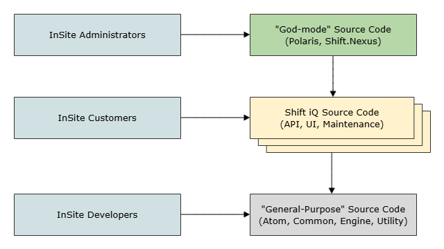
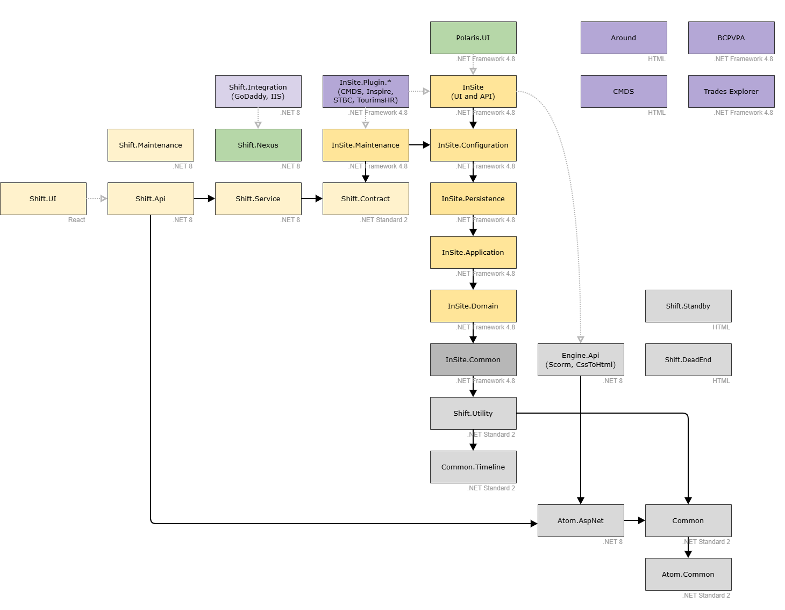
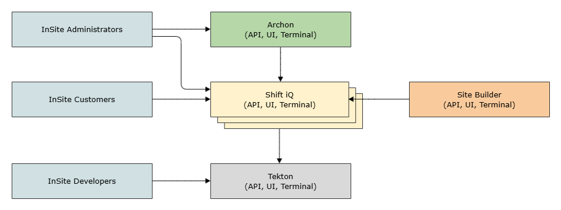
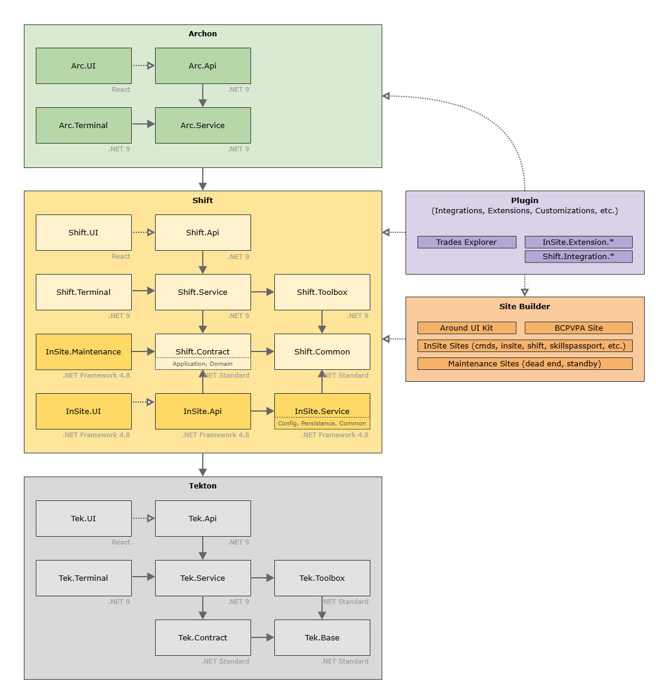
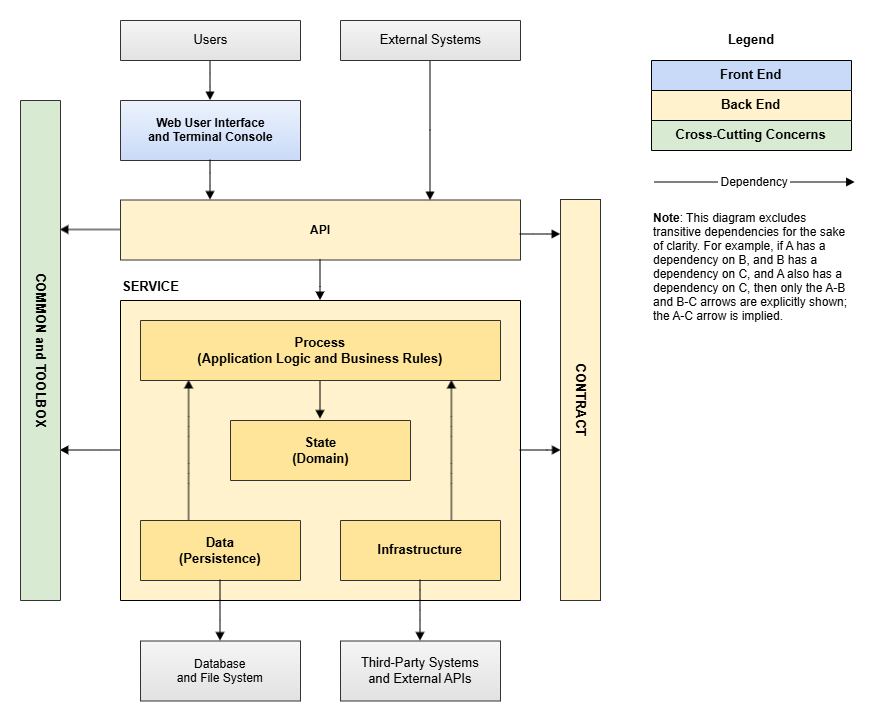

# Architecture

## Overview

Source code for the software developed by InSite can be organized into three (3) broad systems:

<figure><figcaption></figcaption></figure>

**Shift iQ** is a multitenant enterprise software system, and its source code depends heavily upon **general-purpose** source code that is written and maintained by InSite developers. General code is not specific to any part of Shift iQ, and therefore has no dependencies on Shift iQ code.

Octopus is the name of the CI/CD automation system used by InSite, and it has root-level access to every instance of the Shift iQ system. For this reason, it useful to think of source code here as operating in **god-mode**, because it can modify any and all aspects of any and all Shift iQ partitions. Typically, source code in Octopus is developed in PowerShell scripts, but Octopus supports other languages also. Outside PowerShell scripts in Octopus, source code that operates in god-mode includes the Polaris web application, because it operates outside Shift iQ and has dependencies on the Shift iQ API. In addition, we have started to implement source code for platform-wide maintenance purposes (e.g., [DEV-9308](https://insite.atlassian.net/browse/DEV-9308)).

For the purposes of this documentation (at least initially), these conventions are used:

* "God-mode" is abbreviated "God" and is color-coded green.
* "Shift iQ" is abbreviated "Shift" and is color-coded yellow.
* "General-purpose" is abbreviated "General" and is color-coded grey.

## System Dependencies

By design, source code in the **God** system (written and maintained by InSite developers) is tightly coupled to the **Shift** system. The purpose of God code is to implement functionality that spans all instances of the Shift platform. Typically, this functionality relates to administrative and infrastructure needs, but it can relate to user-facing functionality also.

The largest amount of source code is in the Shift system, and it is tightly coupled to code in the General system.

It is important to understand (and strictly enforce) both these dependencies.

| **God** | **Shift iQ** | **General** |
| --- | --- | --- |
| **Instances:** One instance of this software is deployed to Development, Sandbox, and Production environments. This instance is granted access to all Shift partitions. | **Instances:** Multiple instances of this software are deployed to Development, Sandbox, and Production environments. Each instance is referred to as a "partition" (or "tenant"). | **Instances:** One instance of this software is deployed to Development, Sandbox, and Production environments. This instance is shared by all Shift partitions. |
| **Dependencies:** Shift code and General code must never have any upstream reference to God code. In other words, Shift partitions do not know God system exist, and therefore the Shift system cannot have any knowledge of (or dependency on) source code implemented in the God system. | **Dependencies:** An instance of Shift system must never have any upstream, downstream, or lateral dependency on any other instance. In other words, a partition does not know that any other partition exists, and therefore cannot have any knowledge of (or dependency on) another partition. This guarantees each partition is 100% isolated from all other partitions. | **Dependencies:** General code must never have any upstream reference to Shift code. In other words, General code does not know that Shift exists, and therefore cannot have any knowledge of (or dependency on) any part of the Shift system - including its API, user interface, database schema, and so on. |
| **Confidentiality:** For security reasons, God code must be managed in private repositories only. | **Confidentiality:** Most Shift code is managed in private repositories, although some public access might be granted. For example, customers might be granted access to API contract class libraries. | **Confidentiality:** In principle, General code should be available in public repositories as open source, and should be useful to developers implementing their own systems for their own customers. |

## Project Dependencies

You can see the system dependencies more clearly in the following diagram, which shows the dependencies between all projects in the [InSite Code repository](https://github.com/InSite/Code). The color-coding here is especially helpful. (Custom projects are colored purple.)

> Note: Test projects are omitted for clarity, because they (potentially) reference everything everywhere. Redundant dependency arrows are omitted for simplicity. For example, if A depends on both B and C, and B depends on C, then an arrow is shown from A to B, and from B to C. The arrow from A to C is implied, and therefore not necessary to include in the diagram.

<figure><figcaption></figcaption></figure>

## Constructive Criticism

Historically, InSite has not had a cohesive, focused design/implementation strategy for General source code or God source code. Therefore, code for both systems exists in different projects with different names and different namespaces, each of which has evolved at a different pace, depending on the needs driving it, and depending on the version of .NET that the code is written to target.

This problem is clearly observed in the project dependency diagram above. For example:

* General code appears in projects (and namespaces) with names that start "InSite.", "Shift.", "Common.", "Engine.", and "Atom.".
* God code appears in projects with names that start "Shift." and "Polaris.".

Basically, the approach to General code and God code has not been carefully planned, and it is important to takes steps to correct this, so that we have a more disciplined approach going forward. This is important for many reasons, including overall system security, stability, reliability, performance, operational maintenance, and developer sanity!

## Overview Revisited (Future State)

I propose a "reset" in our thinking about General source code and God source code. No immediate steps are necessary here, but we can formalize a design of the desired "future state". In other words, we should have a clear picture of the overall system software architecture that we are working toward.

To help clear and reset our thinking about General code and God code, the Overview diagram can be reimagined this way, with some added context for further clarity:

<figure><figcaption></figcaption></figure>

### God = Archon

Given the responsibility of the code in this system, I suggest the name Archon (abbreviated **Arc**). [Archon](https://en.wikipedia.org/wiki/Archon) is a Greek word that means "ruler".

This name is short and descriptive, and helps ensure a clear distinction between Shift application features and super-user, god-mode, platform-wide maintenance and administration features.

In the short term, this code would include platform-wide maintenance operations related to IIS and GoDaddy, as well as Polaris.UI (Site Builder) for website content management and hosting. In the future, this can also include centralization of platform-wide configuration settings and password management for platform administrators with user accounts that span multiple partitions.

### General = Tekton

Given the responsibility of the code in this system, I suggest the name Tekton (abbreviated **Tek**). [Tekton](https://en.wikipedia.org/wiki/Tekt%C5%8Dn) is a Greek word that means "toolmaker" or "craftsman".

This name is short and descriptive, and it helps ensure a clear distinction between Shift application features (per-partition) and reusable general-purpose features (platform-wide). Also, it is separate from all names previously given to General code, which helps reset our thinking about exactly what source code does (or does not) belong here.

### API, UI, and Terminal

Notice I propose an API, and a UI, and a Terminal component in all 3 systems. Here is my rationale for this:

* Many experienced software architects recommend console-first as an application development best-practice, and I am inclined to agree this is an excellent idea. Some of the best and most successful software systems in the world were initially designed and implemented as terminal (console) applications. GUIs and APIs were implemented afterward. (Git is one such example.)

Historically, we have taken a UI-first approach to our software development work. This has led to an imperfect architecture, with a lot of source code in layers where it does not belong (e.g., persistence logic in the presentation layer), and this makes the system more complex and more difficult to test.

In an ideal, perfect-world, future state, all functions in the UI should be available also in the API and in the console - which ensures a simpler, cleaner, and more testable architecture. Therefore, I propose a Terminal console app in all 3 core InSite systems.

## Project Dependencies Revisited (Future State)

To understand more clearly how the current state evolves to the future state (eventually!), this diagram shows the proposed dependencies between projects in the [InSite Code repository](https://github.com/InSite/Code), with small boxes to show how existing projects move into the future state.

For example, in this future state we will see:

* The existing Polaris.UI project is renamed to Site Builder. The Around project becomes a component within Site Builder, where it belongs. If the BCPVPA and CMDS website projects still exist, then they are components within the Site Builder code base also.
* Any and all "custom" code is implemented as Plugin source code. This includes integrations to third-party systems, and extensions to Shift functionality implemented for specific organizations. Such code is permitted to have dependencies on Shift source code, but Shift code cannot have any dependencies on Plugin code. (Note: A class in the Shift code can depend on an interface to an external system, for example, but the implementation of that interface would be required to exist in Plugin code.)
* God code (i.e., the Archon system) provides platform-wide tools for InSite administrators and developers. For instance, it might perform data-integrity checks on all Shift partitions, propagate password changes for user accounts, and so on. (It is useful to note that Octopus could be configured to perform all such tasks, but in some cases these tasks will be easier to implement and maintain with our own source code.)
* .NET Framework code will remain for a long time. When there is opportunity, such code can be ported to .NET Standard libraries, where it can be referenced by both .NET Core and .NET Framework projects.

<figure><figcaption></figcaption></figure>

### Clean Architecture

The Clean Architecture pattern still has a role within the architecture of the system. Dependencies between classes in the UI, API, Service, and Contract libraries should be organized with Clean Architecture principles in mind. It is not always possible to follow these principles in a modular monolith, but when it is possible to do so, it is a good idea.

<figure><figcaption></figcaption></figure>

(More documentation is coming!)
