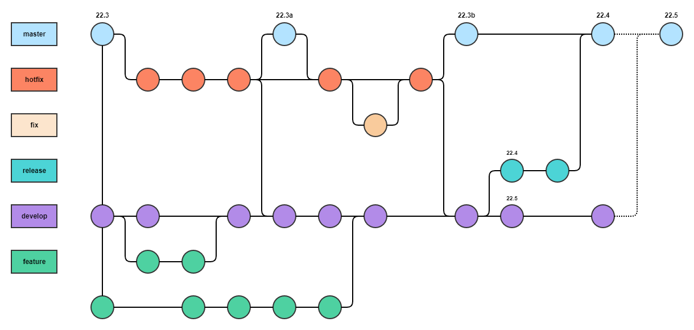

# Git branches

This article describes the purpose for each branch in the InSite Code repository, and the naming conventions for each branch.

<figure><figcaption></figcaption></figure>

## master

The **master** branch contains the code running in the Production and Sandbox environments.

## hotfix

The **hotfix** branch is used to quickly patch Production releases. It is based on the **master** branch.

Any and all merges into the **master** branch require approval from at least two InSite developers. In other words, no individual developer is able to commit changes to the **master** branch without another developer's review and approval of the commit(s) in a Pull Request.

Therefore, all hotfixes to Production are implemented in the **hotfix** branch.

When a hotfix is complete, it is merged into both **master** and **develop** (or the upcoming **release** branch), and **master** is tagged with an updated version number.

### fix

Each new fix may reside in its own branch. (Fix branches are optional).

All **fix** branches use the **hotfix** branch as their parent branch.

A **fix** branch is typically a local branch only. If it requires collaboration between multiple developers, or if you want a backup on GitHub, then you can commit such branches to the remote repository.

The name for a **fix** branch should follow this convention:

* `fix/developer/issue`

... where "developer" is your first name (lower case) and "issue" is a Jira issue number or a Sentry issue number.

For example:

* `fix/daniel/dev-2942`
* `fix/daniel/insite-22`

## develop

The **develop** branch contains the code running in the Development environment. This is the "work-in-progress" for the next release.

### feature

Each new feature may reside in its own branch. (Feature branches are optional).

All **feature** branches use the **develop** branch as their parent branch.

A **feature** branch is typically a local branch only. If it requires collaboration between multiple developers, or if you want a backup on GitHub, then you can commit such branches to the remote repository.

> Note: **feature** branches never interact directly with **hotfix** or **master**.

The name for a **feature** branch should follow this convention:

* `feature/developer/issue`

... where "developer" is your first name (lower case) and "issue" is a Jira issue number or a Sentry issue number.

For example:

* `feature/adam/dev-1586`
* `feature/adam/dev-2286`
* `feature/oleg/dev-2704`

### release

When the **develop** branch has acquired enough features for a release (or a predetermined release date is approaching), you fork a **release** branch from the **develop** branch, tagged with the version number.

Creating this branch starts the next release cycle, so no new features are added after this point. Only bug fixes, documentation generation, and other release-oriented tasks are committed to a **release** branch.

When the **release** branch is ready for release to Production, the **release** branch is merged into **master** and tagged with the version number. In addition, of course, it is merged back into develop, which may have progressed since the release was initiated.

Using a dedicated branch to prepare releases makes it possible for one developer to polish the current release while another developer works on features for the next release. Also, this approach helps to clearly define development phases. For example, it is easy to say, "This week we are preparing for version 22.5," and see this in the structure of the repository.

The name for a **release** branch should follow this convention:

* `release/version`

... where "version" is the version number.

For example:

* `release/v22.3`
* `release/v22.4`
* `release/v22.5`

## Workflow examples

The [Gitflow Workflow](https://www.atlassian.com/git/tutorials/comparing-workflows/gitflow-workflow) describes the process that we follow for branches in this repository.

### Process for feature development

1. Create a local feature branch
   * `git checkout develop`
   * `git checkout -b feature/alice/dev-1234`
2. Code changes are completed on the local feature branch.
3. Merge local feature to develop branch.
   * `git checkout develop`
   * `git merge feature/alice/dev-1234`
   * `git push`
4. Delete local feature branch.
   * `git branch -d feature/alice/dev-1234`

### Process for unstable release (development work in progress)

1. `git checkout develop`
2. `git pull`
3. Build and deploy to the Development environment.

### Process for stable pre-release

1. Create a new release branch
   * `git checkout develop`
   * `git checkout -b release/v22.1`
   * `git merge develop`
2. Build and deploy to the Development and Sandbox environments.

### Process for final stable release

1. Create a Pull Request to merge release/v22.1 into master.
2. Review and approve Pull Request.
3. Merge commits into master.
4. Create a Release (i.e. tag the master branch with the version number).
5. `git checkout master`
6. Build and deploy to the Sandbox and Production environments.
7. Recreate the hotfix branch from master.
   * `git branch -d hotfix`
   * `git push origin --delete hotfix`
   * `git branch hotfix`
8. Delete the release branch.
   * `git branch -d release/v22.1`
   * `git push origin --delete release/v21.1`

### Process for hotfix development

1. Create a local fix branch.
   * `git checkout hotfix`
   * `git checkout -b fix/alice/dev-5678`
2. Code changes are completed on the local fix branch.
3. Push local fix branch to origin
   * `git push -u origin fix/alice/dev-5678`
4. Create a pull request for code review and approval.
5. After the pull request is approved and your fix branch is merged into the hotfix branch, delete your fix branch and merge the hotfix branch into the develop branch.
   * `git branch -d fix/alice/dev-5678`
   * `git checkout hotfix`
   * `git pull origin hotfix`
   * `git checkout develop`
   * `git pull origin develop`
   * `git checkout -b merge-hotfix-into-develop`
   * `git merge hotfix`
   * (fix merge conflicts, if any)
   * `git push origin merge-hotfix-into-develop`
6. Create a Pull Request to merge the merge-hotfix-into-develop branch.

## Pre-release week

The week leading up to the release of a new version to Production is "Pre-Release Week", and this has some characteristics outside our normal workflow.

1. Code in the **develop** branch is not deployed to any environment.
2. Code in the **release** branch is deployed to the Development environment and to the Sandbox environment.
3. When the new version is ready to deploy to Production:
   1. The **release** branch is merged into the **master** branch and the **hotfix** branch.
   2. The normal build and deployment workflow resumes: the **develop** branch is deployed to the Development environment; the **hotfix** branch is deployed to **Sandbox** and then to **Production**.

**Please Note:**

This means features and fixes in the develop branch are not visible in any environment during pre-release week, and cannot be made available to users (outside our Local environments).

If there is a request from someone to see some new feature or fix from the **develop** branch then the requester needs to wait until after pre-release week, when the **develop** branch is deployed to the Development environment.

During pre-release week only:

* Code changes for issues assigned to "**Fixes (Development)**" are implemented in the **develop** branch.
* Code changes for issues assigned to "**Fixes (Production)**" are implemented in the **release** branch.
* Therefore, any fixes needed for the pending release should be assigned to "**Fixes (Production)**".
