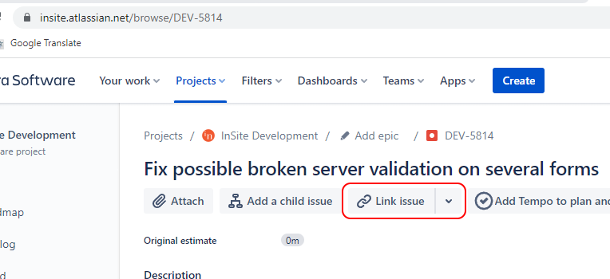
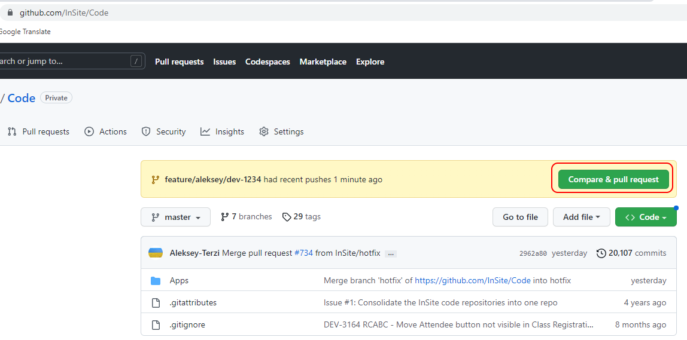
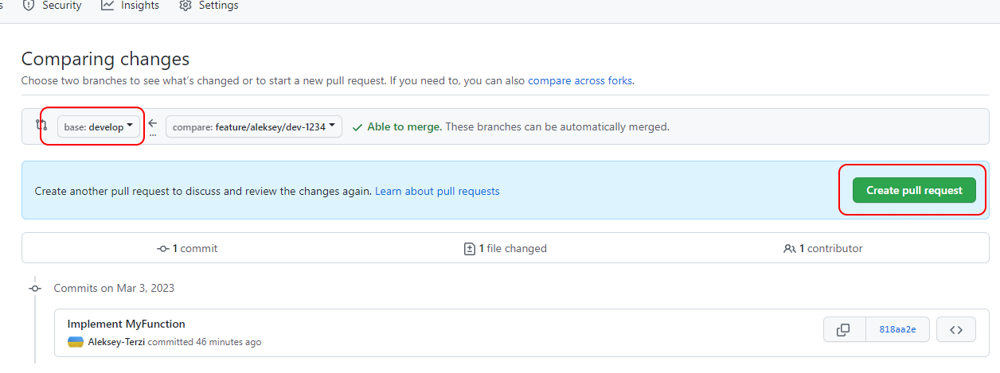
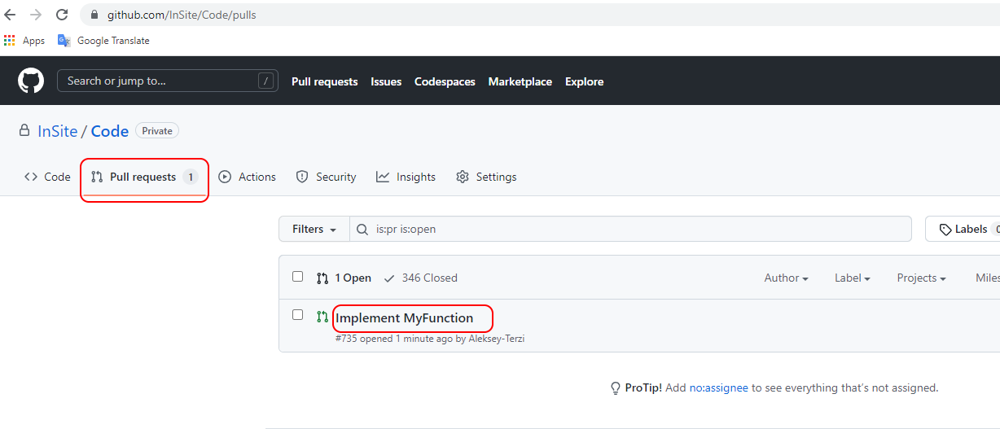
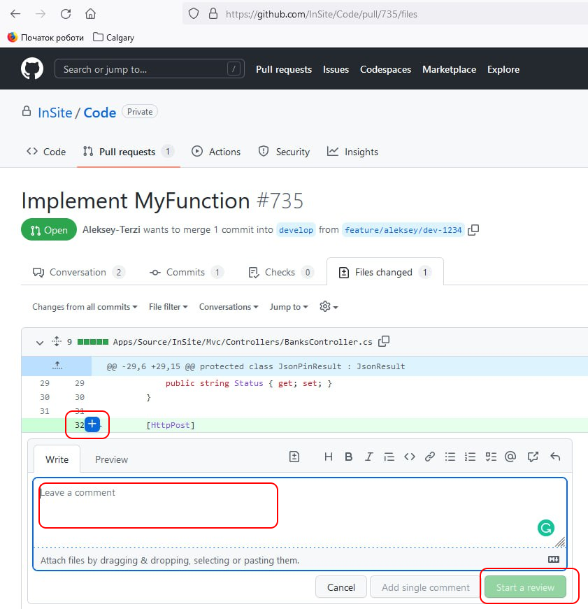
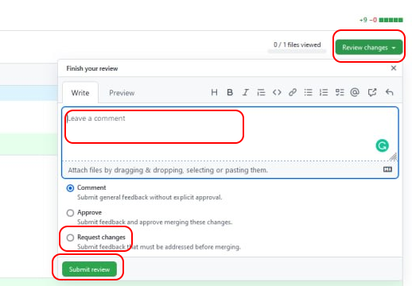

# Git pull requests

The general approach to managing branches in GitHub is described here:

* [Managing Branches in GitHub](git-branches.md)

More details about pull requests (**PR**) and the review process are described here:

* [https://docs.github.com/en/pull-requests/collaborating-with-pull-requests/proposing-changes-to-your-work-with-pull-requests/about-pull-requests](https://docs.github.com/en/pull-requests/collaborating-with-pull-requests/proposing-changes-to-your-work-with-pull-requests/about-pull-requests)

Details about how the Github actions automatically build and test are found here:

* Rapid Test Feature Branch
* [https://insite.atlassian.net/wiki/spaces/PD/pages/110133249/Rapid+Test+Feature+Branch#Github-Failure-Recovery](https://insite.atlassian.net/wiki/spaces/PD/pages/110133249/Rapid+Test+Feature+Branch#Github-Failure-Recovery)

### Steps to implement and submit code changes for resolving a Jira issue (as a **developer**):

1. Create a new local feature branch. For example: **feature/alice/dev-1234**
2. Implement the requested changes to the code in the local feature branch.
3. Commit changes to the local feature branch and push the commit to GitHub.
4. Create a new Pull Request (PR) to the base branch:\
   \- Select the **hotfix** branch for hotfixes.\
   \- Select the **develop** branch for the current development tasks.
5. If you want someone specific to review your change then assign them as reviewer(s) in your Pull Request.
6. The PR description should contain the list of links to Jira issues to which this PR is related to.
7. The reviewer may post a comment requesting some improvement to your code before approving the Pull Request. In this case, implement the improvement in your local feature branch (e.g. **feature/alice/dev-1234**), commit the change, and push the commit again to GitHub.
8. In some cases you might prefer to resolve multiple Jira issues in one feature branch and then submit one Pull Request for all of them together. Ideally, each Pull Request should be relatively small, so the review does not take too much effort, therefore consider this option carefully.
9. Do not push commits for the new issues into the PR where the review process was already started
10. f it is needed to close PR where was started the review then please specify the reason for this

### Steps to approve a pull request (as a **reviewer**):

1. A Pull Request must be approved by at least one person (who is not the developer) before it can be merged. Note the review process can be started by multiple people.
2. Sign in to GitHub, select the repository, and click the **Pull requests** tab.
3. Select the Pull Request that you are ready to review.
4. Click the **Files changed** tab.
5. If the code looks good, then click **Review changes** and approve the changes.
6. If the code needs to be improved, then post a comment on the lines that need to be improved, and then request changes from **Review changes**
7. Wait for the developer to make the requested improvements or to explain the reasons for leaving the code as it is.
8. Review changes/explanations, and if something still needs improvement/clarification then continue the discussion. Otherwise, if everything is done, then approve changes.
9. After the **Pull Request** is approved by all reviewers then the developer who has merge permissions merges the code.

### Steps for the reviewer to make changes he/she decided to implement while were reviewing the code:

1. During the PR review, the reviewer found some issues not related to the PR that he/she wants to fix/implement
2. In this case, create either a child task for the current task or a new task
3. Make sure the new task and the original task are linked either as a child issue or via “Link Issue” button:

   <figure><figcaption></figcaption></figure>
4. Push your changes and create a new PR for this new task

### Jira and PR requests

Once we are ready to perform the pull request on our code:

1. <…>

After our code is reviewed and completed:

1. <…>

## Example

### Developer Workflow:

Here is the git command to create a check out a new local feature branch:

* `git checkout -b feature/aleksey/dev-1234`

After I have implemented my changes, here are the git command to commit and push my change to GitHub:

* `git add *`
* `git commit -m DEV-1234`
* `git push origin feature/aleksey/dev-1234`

After my changes are pushed, then I click this button to create a new PR:

<figure><figcaption></figcaption></figure>

Then select a base branch and click **Create pull request**:

<figure><figcaption></figcaption></figure>

### Reviewer Workflow:

Select the required PR

<figure><figcaption></figcaption></figure>

Comment on the line:

<figure><figcaption></figcaption></figure>

Request changes:

<figure><figcaption></figcaption></figure>
