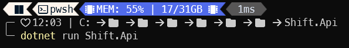
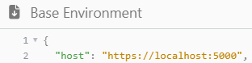
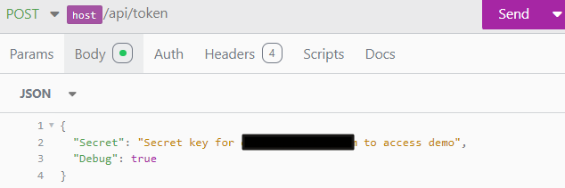
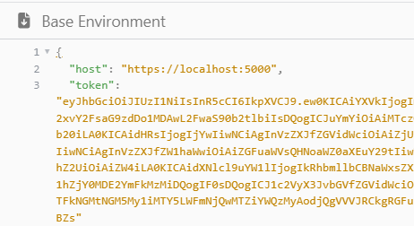
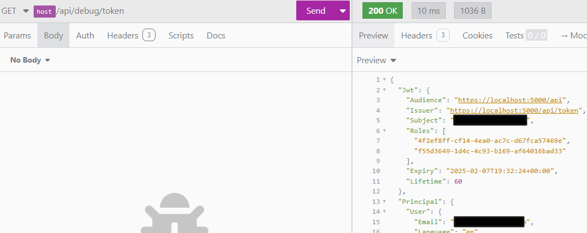

# Introduction

## API Endpoints

Primary API endpoints provide access to basic core functions that store and search data.

Secondary API endpoints provide all other functionality.

The same general approach and naming patterns should apply to all API endpoints, primary and secondary.

### Collection Names

An API endpoint represents a collection of items. It has a URL that follows this pattern:

* api/component/collection

**Component** is a singular noun that identifies a logical module within the platform, and **Collection** is a plural noun that identifies a subset of data within the module. For example:

* api/contact/groups

If the items in a collection represent relationships, and if the relationship type is not assigned its own discrete noun, then the collection name is a hyphenation of the names of the items in the relationship.

For example, suppose we have a many-to-many relationship between groups and users, where each group can contain many users, and each user can join many groups.

* If the relationship is named "Membership" in the data model, then the expected collection name is "memberships".
* Otherwise, if the relationship has no singular-form noun in the data model (i.e., its database table name is GroupUser) then the collection name in the corresponding API endpoint is "users-groups" or "groups-users".

### Collection Operations

The following table defines basic operations for a typical collection.

| HTTP Method | Type    | Purpose                            | Verb    | URL Stem (example) |
| ----------- | ------- | ---------------------------------- | ------- | ------------------ |
| GET         | Query   | Get a collection of items          | Collect | api/contact/groups |
| POST        | Command | Create a new item in a collection  | Create  | api/contact/groups |

The following table defines additional operations for a typical collection.

| HTTP Method | Type    | Purpose                                | Verb   | URL Stem (example)        |
| ----------- | ------- | -------------------------------------- | ------ | ------------------------- |
| GET         | Query   | Find matching items in a collection    | Search | api/contact/groups/search |
| GET         | Query   | Count the items in a collection        | Count  | api/contact/groups/count  |
| POST        | Command | Download a collection                  | Export | api/contact/groups/export |
| POST        | Command | Upload a collection                    | Import | api/contact/groups/import |
| POST        | Command | Delete a list of items in a collection | Purge  | api/contact/groups/purge  |

### Item Names

An API endpoint that represents a single item in a collection has a URL that follows this pattern:

* api/component/collection/id

**Component** is a singular noun, and **Collection** is a plural noun, and **ID** uniquely identifies a specific item in the collection. For example:

* api/contact/groups/123

Typically, the unique identifier for an item is a GUID value; an integer value is used here for the sake of brevity.

### Item Operations

The following table defines basic operations for a typical item.

| HTTP Method | Type    | Purpose                          | Verb     | URL Stem (example)     |
| ----------- | ------- | -------------------------------- | -------- | ---------------------- |
| GET         | Query   | Get an item from a collection    | Retrieve | api/contact/groups/123 |
| PUT         | Command | Update an item in a collection   | Modify   | api/contact/groups/123 |
| DELETE      | Command | Delete an item from a collection | Delete   | api/contact/groups/123 |

The following table defines additional operations for a typical item.

| HTTP Method | Type  | Purpose                                            | Verb   | URL Stem (example)     |
| ----------- | ----- | -------------------------------------------------- | ------ | ---------------------- |
| HEAD        | Query | Check for the existence of an item in a collection | Assert | api/contact/groups/123 |

### Item Composites

If an item represents a composite object, then parts of the object are located with URLs that look like this:

* api/contact/groups/123/addresses
* api/contact/groups/123/memberships

## Naming Conventions

Whenever possible, a class that implements a command or a query follows these naming conventions.

Specifically, the readability of code is improved when we apply the same meaning to Type and Verb in command names and query names. For example, a class named CreateWidget must be a command (not a query) that creates a new item in a collection of widgets.

This can be summarized in the following tables.

### Queries

A query is implemented in C# and in JavaScript as a class. The class name starts with one of these verbs:

| Verb     | Purpose                                                                                                                  | Method      | Input       |
| -------- | ------------------------------------------------------------------------------------------------------------------------ | ----------- | ----------- |
| Assert   | Check for the existence of one specific item in a collection using its primary key (return a true/false Boolean)         | HEAD        | Uri         |
| Collect  | Find matching items in a collection (return a list of models, suitable for outline and edit forms in a UI)               | GET or POST | Uri or Body |
| Count    | Count the list of matching items in a collection (return an integer)                                                     | GET or POST | Uri or Body |
| Retrieve | Find one specific item in a collection using its primary key (return a model)                                            | GET         | Uri         |
| Search   | Find matching items in a collection (return a list of lightweight models intended for search results, combo boxes, lookups, etc.) | GET or POST | Uri or Body |

This convention helps improve readability because the purpose of a query is clearly documented by its name.

A C# query class should implement the `IQuery<TResult>` interface. This ensures the data type of the result is explicitly defined at compile-time.

Optionally, the query class name may be prefixed with the word "Query".

For example, these query class names follow the convention:

* AssertSurvey : Query\<bool>
* CollectVehicles : Query\<IEnumerable\<VehicleModel>>
* CountSurveys : Query\<int>
* RetrieveLogbook : Query\<LogbookModel>
* SearchGroups : Query\<List\<GroupSearchResult>>
* QueryCountAssessmentAttempts : Query\<int>

These query class names do not follow the convention:

* GetWidget
* ListAnimals

#### Query Results

A query result can be any C# data type, including both value types and reference types. Therefore, a consistent naming convention for query result classes may be difficult to maintain. In general, the following guidelines are optional.

| Query    | Result                                                                                                                                                                                              |
| -------- | --------------------------------------------------------------------------------------------------------------------------------------------------------------------------------------------------- |
| Assert   | Boolean                                                                                                                                                                                            |
| Collect  | A class that represents the result for a Collect query should have the suffix "Model". This helps to express the purpose of the result: i.e., a heavyweight response containing a collection of fully-hydrated data transfer object models. |
| Count    | Integer                                                                                                                                                                                           |
| Retrieve | A class that represents the result for a Retrieve query should have the suffix "Model". This helps to express the purpose of the result: i.e., a heavyweight response containing a single fully-hydrated data transfer object model. |
| Search   | A class that represents the result for a Search query should have the suffix "SearchResult". This makes its purpose clear. For example: GroupSearchResult.                                         |

### Commands

A command is implemented in C# and in JavaScript as a class. The class name must be a verb-noun phrase. Any verb is acceptable, excluding the 6 verbs listed above, which are reserved for queries.

If the purpose of a command is listed in the table below, then the corresponding verb is preferred. For example, the preferred name for a command to create a new group is `CreateGroup`.

| Verb   | Purpose                                         | Method | Input |
| ------ | ----------------------------------------------- | ------ | ----- |
| Create | Create a single new item in a collection        | POST   | Body  |
| Delete | Delete a single existing item from a collection | DELETE | Uri   |
| Export | Download multiple items from a collection        | POST   | Body  |
| Import | Upload multiple items to collection             | POST   | Body  |
| Modify | Update a single existing item in a collection    | PUT    | Body  |
| Purge  | Delete multiple items from a collection          | POST   | Body  |

"Add" and "Remove" have the same basic meaning as "Create" and "Delete". For the sake of consistency, if the verbs Add and Remove are used, then it should be for the purpose of connecting and disconnecting existing items (or adding and removing objects within an aggregate).

For example, AddUserToGroup is the name of a command to connect a user to a group. The verb Add in this scenario helps to express the purpose of this command: no new user is created, and no new group is created. Similarly, RemoveUserFromGroup is a command to disconnect a user from a group; the user is not deleted, and the group is not deleted.

## URL Conventions for React UI

In addition to the naming conventions above, there are two general-purpose API endpoints, designed specifically for the purpose of client code in a React user interface:

* api/react/queries
* api/react/commands

The React UI can use the queries endpoint to run any query, and it can use the commands endpoint to execute any command.

### Using api/react/queries

This general-purpose endpoint is designed to handle any query, where the query is implemented as a class that derives from `Query<TResult>`. It correctly handles variations on the query name. For example, all of these URLs run the same query and return the same result:

* api/react/queries?q=AssertAreYouAlive
* api/react/queries?q=assertAreYouAlive
* api/react/queries?q=assert-are-you-alive
* api/react/queries?q=assert\_are\_you\_alive
* api/react/queries?q=QueryAssertAreYouAlive
* api/react/queries?q=query-assert-are-you-alive
* api/react/queries?q=query\_assert\_are\_you\_alive

When the UI needs a new query from the API, the procedure to implement a new query is three simple steps:

1. Define a query with a strongly typed return value.
2. Implement a function to execute the query.
3. Register the function.

Here is an example:

#### Step 1. Define a query class and a result class

For example, these two classes might be written in a Contract library.

```csharp
public class SearchDistinctBirthdateYears : Query<DistinctBirthdateYear[]>
{ 
  public int? SinceYear { get; set; }
  public int? BeforeYear { get; set; }
}

public class DistinctBirthdateYear
{
  public int Year { get; set; }
  public int Count { get; set; }
}
```

#### Step 2. Implement a function to execute the query

For example, this function might be added to a Search class in a Service library.

```csharp
public DistinctBirthdateYear[] Execute(SearchDistinctBirthdateYears query)
{
  using var db = CreateDbContext();
  
  return db.Persons
    .AsNoTracking()
    .Where(x => x.Birthdate.HasValue)
    .AsQueryable();
      
  if (query.SinceYear.HasValue)
    people = people.Where(x => query.SinceYear <= x.Birthdate!.Value.Year);

  if (query.BeforeYear.HasValue)
    people = people.Where(x => x.Birthdate!.Value.Year < query.BeforeYear);

  return people
    .GroupBy(x => x.Birthdate!.Value.Year)
    .Select(x => new DistinctBirthdateYear
    {
      Year = x.Key,
      Count = x.Count()
    })
    .ToArray();
}
```

#### Step 3. Register the function

For example, this line of code might be added to the Search class constructor from Step 2.

```csharp
RegisterQuery<SearchDistinctBirthdateYears>(q 
    => Execute((SearchDistinctBirthdateYears)q));
```

> **Historical Note**: InSite code has always included the concept of a Query class, but we have used the term "Filter" instead of "Query" for this purpose. The term "Query" is more accurate, and more consistent with common conventions in CQRS+ES implementations.
>
> Essentially, the properties of a query define the criteria to apply to the data source. After the result set for a query is determined (e.g., the rows in a table that match the criteria), the term "Filter" is used to specify a more precise subset of rows and columns to be taken from the result set. Pagination, for example, is one attribute of a Filter.
>
> In other words, a Filter is not a Query. Instead, a Filter is a property of a Query. It will take some time for us to adjust to this change in terminology.

### Securing api/react/queries

Permissions are defined as security settings in `appsettings.json` (In future, permissions may be stored and managed in the database, but this is a simple interim solution.)

Each permission is an object with four properties:

* **Type**: This is always "Http" for API access permissions.
* **Access**: This is a comma-separated list of HTTP Methods (i.e., Head, Get, Put, Post, Delete).
* **Resources**: This is an array of resource names.
* **Roles**: This is an array of role names.

The resource name for a query is derived from the full name of the C# class that implements it. For example, suppose we have a query class in the namespace "Shift.Service.Billing" named "SearchInvoices"; the name of the resource for this query is "shift/service/billing/search-invoices". Here is a permission that allows the Tester role to run this query (and only this query):

```json
{
  "Type": "Http",
  "Access": "Post",
  "Resources": [ "shift/service/billing/search-invoices" ],
  "Roles": [ "Tester" ]
}
```

Here is a permission that allows the Accountant role to run all queries in the Billing namespace:

```json
{
  "Type": "Http",
  "Access": "Post",
  "Resources": [ "shift/service/billing" ],
  "Roles": [ "Accountant" ]
}
```

Resource names are calculated from query names at run-time (using reflection), so there is no requirement to register or define resource names for queries in any part of the system. The API includes this method for our own internval developer use, so we can see the full list of available resource names, based on the queries implemented in the code: `GET api/debug/resources`

#### Resource Identifiers and Role Identifiers

API access permissions defined in appsettings.json use resource names and role names (not identifiers) so they are easy to read and understand. At run-time, the system generates a v5 UUID for each resource name and each role name, and it uses this UUID value internally to identify each resource and role.

> Note: Version 5 UUIDs are deterministic. This means the v5 UUID calculated for the role name "Tester" is always the same.

### Using api/react/commands

This general-purpose endpoint is designed to handle any Timeline command, where the command is implemented as a class that derives from `Command`. It correctly handles variations on the command name. For example, all of these URLs execute the same command:

* api/react/commands?c=CreateGroup
* api/react/commands?c=createGroup
* api/react/commands?c=create-group
* api/react/commands?c=create\_group

When the UI needs a new query from the API, the procedure to implement a new command is the same procedure that we follow to implement any new command that follows the CQRS+ES pattern.

## Monitoring and Measuring API Usage

This is NOT yet implemented, but is it very important to do so. I propose the following requirements for our implementation:

* For every API key issued, monitor the number of incoming API requests, the size of each request, and the size of each response. If possible, monitor the execution time for each request.
* Include `X-Request-Count` in every API response header, so clients are able to monitor their usage.
* Use the request size, response size, and (if possible) execution time to calculate the Cost for each request.
* Include `X-Request-Cost` in every API response header, so clients are able to monitor their usage.
* Determine a reasonable quota (i.e., rate limit), in terms of Request Count and Request Cost for API keys.
* Determine an algorithm for automatically replenishing the quota for an API key.
* Include `X-Request-Quota-Remaining` in every API response header, so clients can plan and measure their API usage.
* When an API key exceeds its quota, the API must respond with `403 Forbidden (Quota Exceeded)`.

## Getting Started with the Shift API

Here are the steps to confirm the Shift API is working in your local environment.

Step 1. Create a secret key in the Shift database.

```sql
USE E01_Local_Shift;

-- Get the UUID for a specific organization.
DECLARE @organizationCode VARCHAR(10) = 'demo';
DECLARE @organizationId UNIQUEIDENTIFIER = (SELECT OrganizationIdentifier FROM accounts.QOrganization WHERE OrganizationCode = @organizationCode);

-- Get the UUID for a specific person.
DECLARE @userEmail VARCHAR(254) = 'daniel@shiftiq.com';
DECLARE @userId UNIQUEIDENTIFIER = (SELECT UserIdentifier FROM identities.QUser WHERE Email = @userEmail);
DECLARE @personId UNIQUEIDENTIFIER = (SELECT PersonIdentifier FROM contacts.QPerson WHERE UserIdentifier = @userId AND OrganizationIdentifier = @organizationId);

-- To simplify testing, delete all existing secrets, and insert one specific secret. Force it to expiry one hour in the future.
TRUNCATE TABLE contacts.TPersonSecret;
INSERT INTO contacts.TPersonSecret
( PersonIdentifier, SecretIdentifier, SecretType, SecretName, SecretLifetimeLimit, SecretValue, SecretExpiry )
VALUES
( @personId, NEWID(), 'Token', 'Authentication', 30, 'Secret key for ' + @userEmail + ' to access ' + @organizationCode, DATEADD( HOUR, 1,  GETUTCDATE() ) );

-- Confirm the secret exists.
SELECT * FROM contacts.TPersonSecret;
```

Step 2. Start the API.

<figure><figcaption></figcaption></figure>

Step 3. Start Insomnia and edit the Base Environment settings. Confirm your host is correct.

<figure><figcaption></figcaption></figure>

Step 4. Send the request named "Get API status" (`api/status`) to confirm the API is running. This is a health-check endpoint, and it does not require authentication or authorization.

Step 5. Click the Body tab for the request named "Generate API token" (`api/token`). Confirm your secret is correct.

<figure><figcaption></figcaption></figure>

Step 6. Send the `api/token` request. Copy and paste the response (an encoded JWT) to your Base Environment settings.

<figure><figcaption></figcaption></figure>

Step 7. Use the request named "Test authorization header" (`api/debug/token`) to confirm the API correctly decodes your Bearer authorization token.

<figure><figcaption></figcaption></figure>

### Next Steps

These endpoints are available to test and explore the API:

* `api/debug/paths` - List all the available endpoints. This is determined using reflection on the literal constants by Endpoints in the Contract library.
* `api/debug/resources` - List all resources for which permissions are specified. These are determined by the Permissions section in appsettings.json.
* `api/debug/permissions` - List all permissions granted. These are determined by the Permissions section in appsettings.json.
</content>

</invoke>
