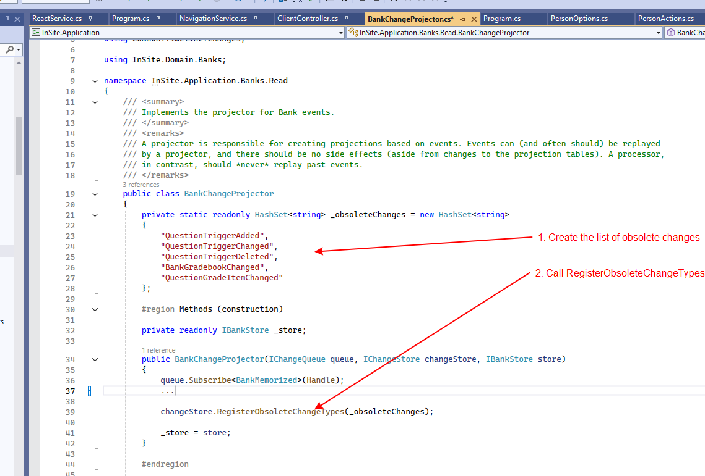
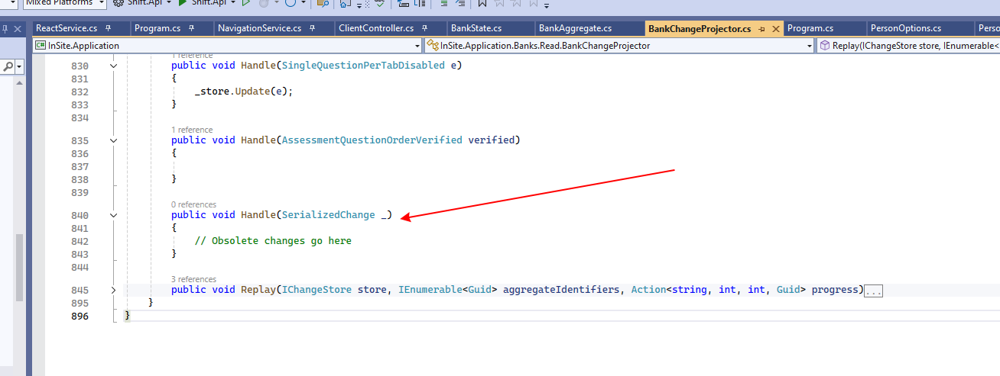
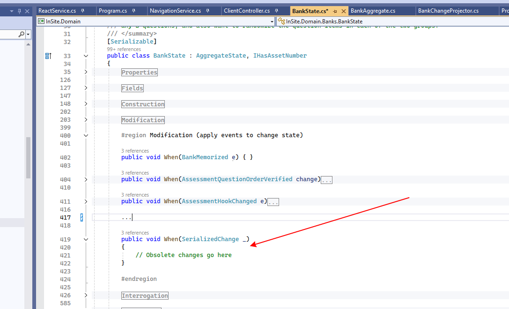
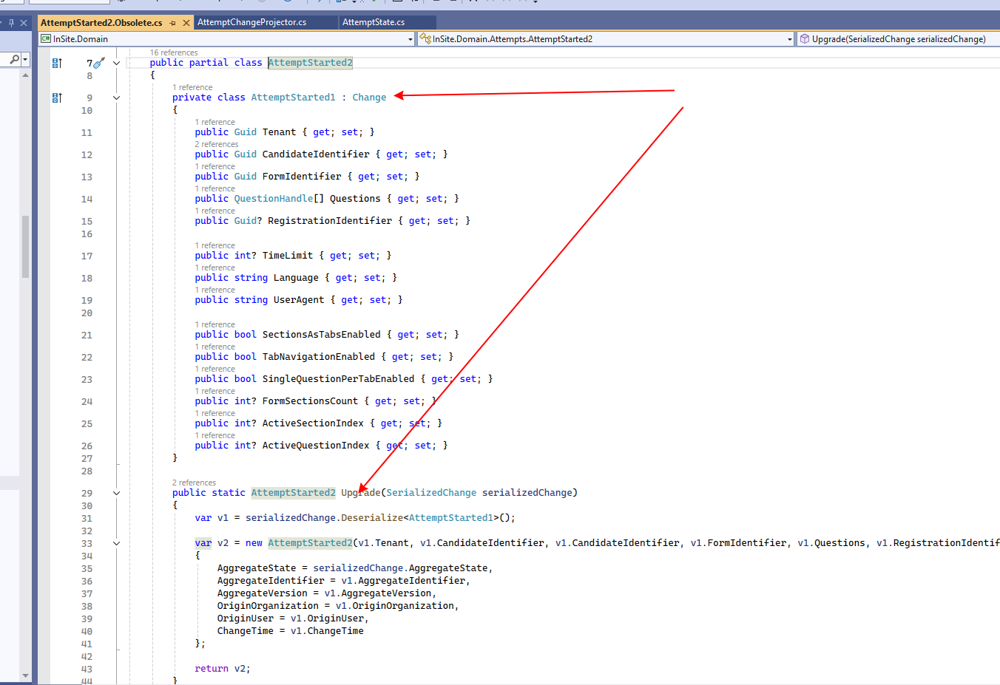
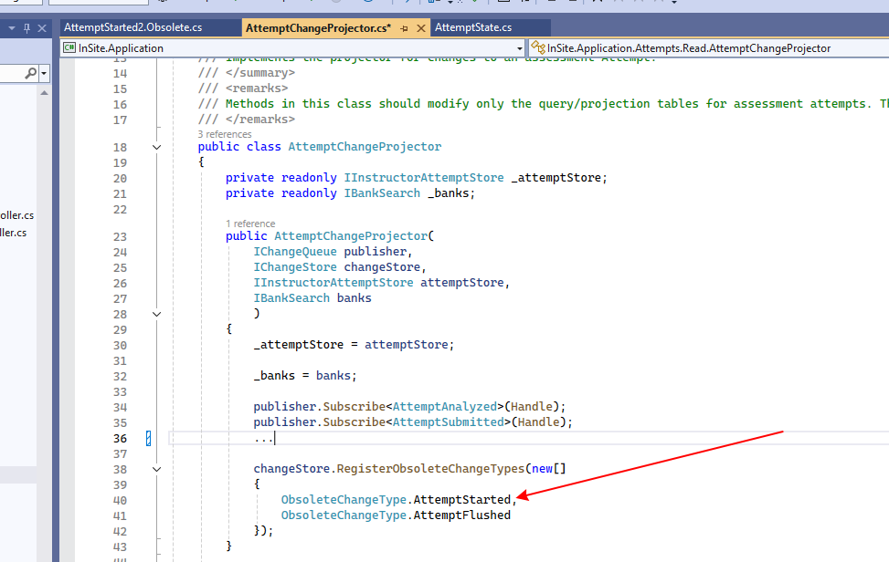
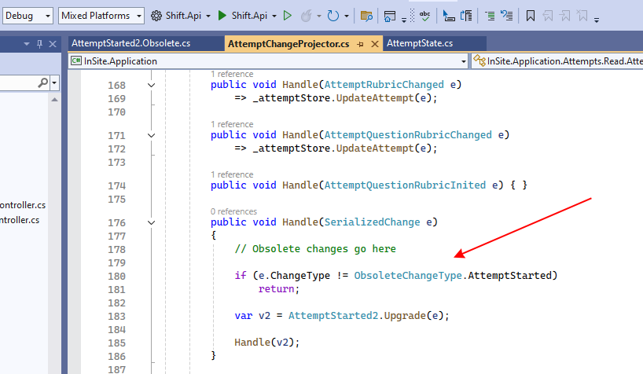
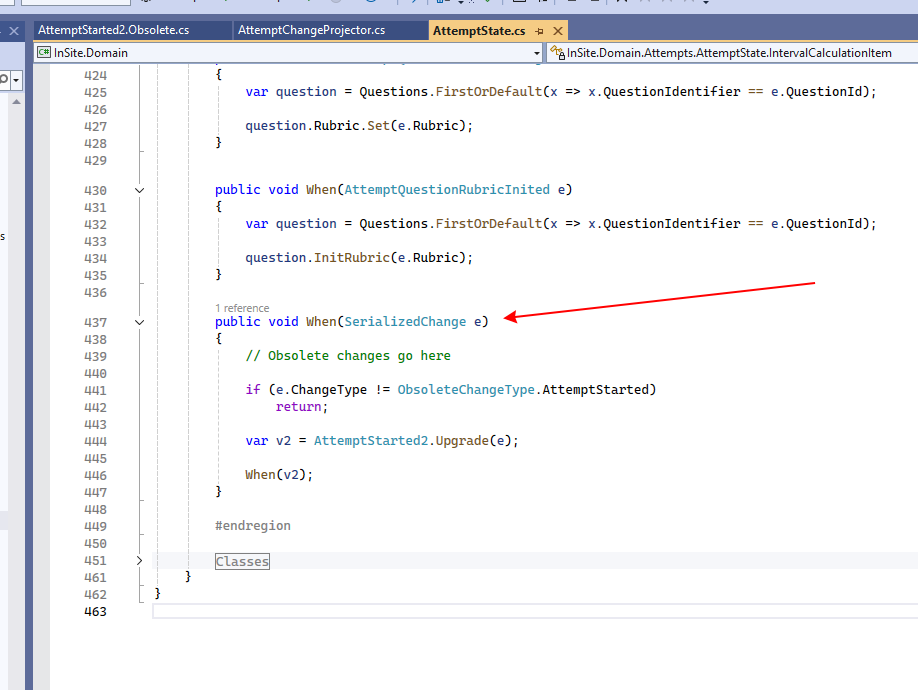

# Obsolete timeline changes

We have two kinds of obsolete Changes:

1. The Change can be ignored (we either don't use it at all or we push new changes that replace the old one)
2. The Change should be upgraded to a newer version

## The Change can be ignored

1. Delete the obsolete C# Change class and the related C# code
2. Create the list of obsolete changes
3. Register this list in the Projector's class constructor:

   <figure><figcaption></figcaption></figure>
4. Add a new Handle method for SerializedChange to the Projector class:

   <figure><figcaption></figcaption></figure>
5. Add a new When method to the State class, it will intercept all obsolete changes:

   <figure><figcaption></figcaption></figure>

## The Change should be upgraded to a new version

Lets assume we have the change **AttemptStarted1** and it needs to be marked as obsolete because we introduced a new change **AttemptStarted2**

1. Make **AttemptStarted1** as a private nested class of **AttemptStarted2** and implement a new Upgrade method that will convert AttemptStarted1 to AttemptStarted2:

   <figure><figcaption></figcaption></figure>
2. Delete all functionality related to **AttemptStarted1**
3. In the AttemptChangeProjector register AttemptStarted1 as an obsolete change:

   <figure><figcaption></figcaption></figure>
4. Add a new Handle method in the Projector class that will upgrade **AttemptStarted1** to **AttemptStarted2** and call Handle for **AttemptStarted2**:

   <figure><figcaption></figcaption></figure>
5. Add a new When method to AttemptState that will upgrade **AttemptStarted1** to **AttemptStarted2** and call When for **AttemptStarted2**:

   <figure><figcaption></figcaption></figure>
