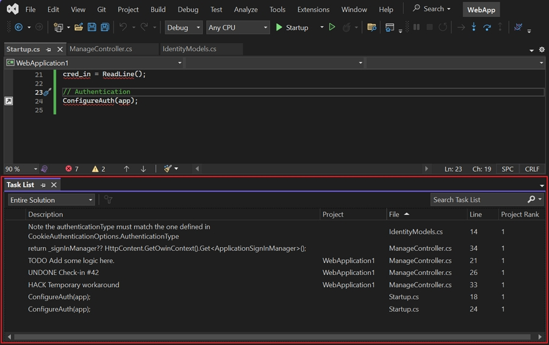
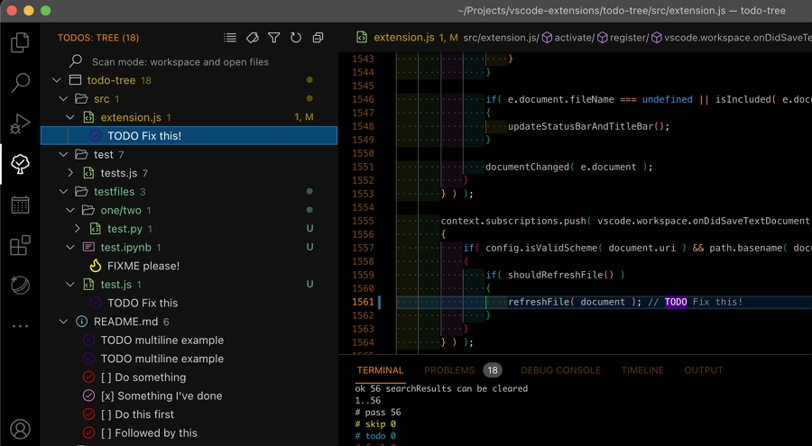

# Task list comment tokens

Task list comment tokens improve code maintainability and communication between busy developers by marking unfinished tasks or known issues directly in the source. They integrate well with tools for tracking and automation, making them valuable for managing technical debt and streamlining code reviews.

## Comment tokens

Here is a list of color-coded tokens used the source code for this platform.

🔴 **RED** code does not work/compile:

```csharp
// ERROR: This code throws a specific reproducible error.

// BROKEN: This code is broken and will not run.

// WTF: WHAT THE ****?
```


🟠 **ORANGE** code works but is not right:

```csharp
// HACK: This code has intentionally been hacked to work. It should NOT go into any 
// production release.

// FIXME: This code works but could be better. Needs better abstraction, 
// maintainability, performance, etc.

// BUG: This code works and was expected to be right but a bug has been found (usually
// flagged post-production).

// REVIEW: This code is probably right but should be reviewed for peace of mind.

// SMELLS: Same as FIXME.
```


\
🔵 **BLUE** code works but needs more features or more explaining:

```csharp
// TODO: Functionality is planned but not yet implemented.

// NOTE: Better explain what's going on. This gives a higher profile to standard 
// comments and allows notes to be found in the to-do pane.
```

## Visual Studio

The [Task List](https://learn.microsoft.com/en-us/visualstudio/ide/using-the-task-list?view=vs-2022) tool in Visual Studio lets you track code comments that use tokens like `TODO` and `HACK` or custom tokens. For example:

<figure><figcaption></figcaption></figure>

## VS Code

VS Code does not natively support Task List comment tokens in the same way as Visual Studio, but equivalent functionality is achieved using the [ToDo Tree](https://marketplace.visualstudio.com/items?itemName=Gruntfuggly.todo-tree) extension.

**Extension ID:** `Gruntfuggly.todo-tree`

You can define additional tags in the extension settings, and you can also define your own styles, regexes, and folders to include/exclude. For example:

<figure><figcaption></figcaption></figure>
