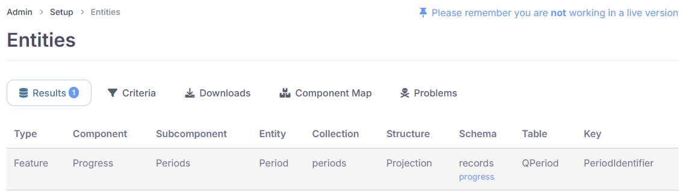
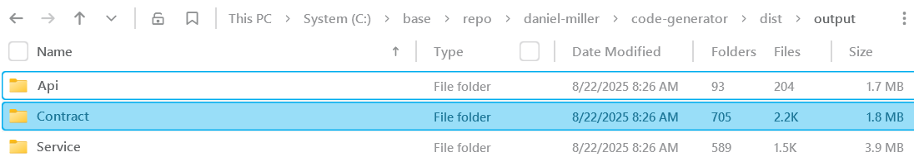
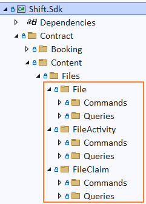
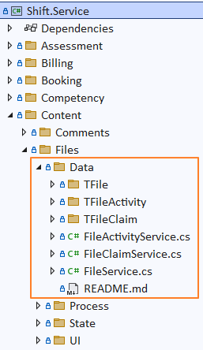
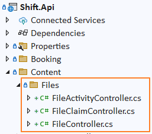
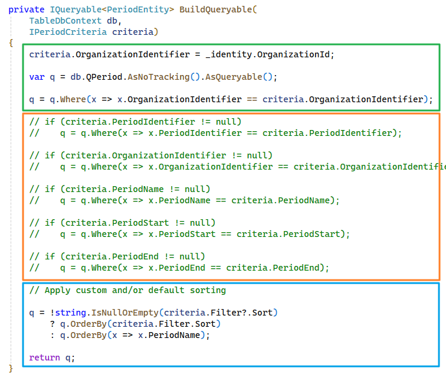
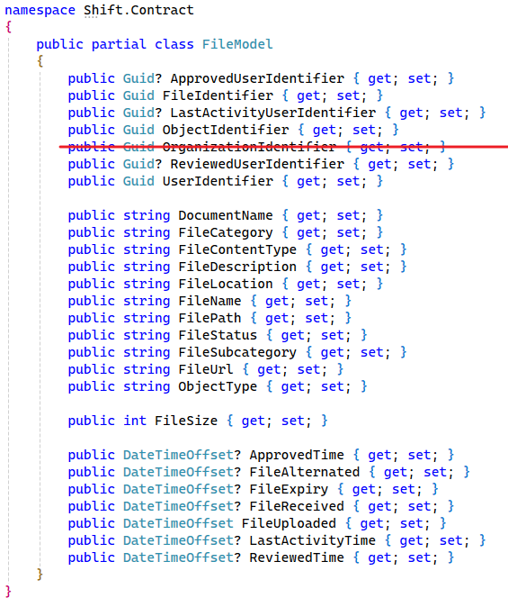
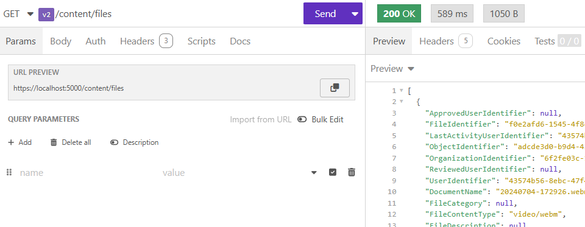

# Add a new set of API endpoints

## Before you start

### Define the entity

Before you start, navigate to `ui/admin/metadata/entities/search` in your local environment and search for the entity definition.&#x20;

> If no entity is defined for the database table then you need to define a new entity by inserting a new row in **metadata.TEntity**.

When you find the entity definition, make special note of the Component, Subcomponent, and Entity Name.

<figure><figcaption></figcaption></figure>

### Prepare the code generator

Download the code generator - [https://github.com/daniel-miller/code-generator](https://github.com/daniel-miller/code-generator)

Open **appsettings.json** and update the configuration settings for your local environment. Optionally, you  can create an **appsettings.local.json**, which is not added to source control. Your settings should look something like this:

```json
{
  "Generator": {
    "PlatformName": "Shift",
    "TemplateFolder": "./Template",
    "OutputFolder": "../../dist/output",
    "DatabaseType": "SqlServer",
    "DatabaseConnection": "Data Source=(local); Initial Catalog=E01_Local_Shift; Integrated Security=True; Encrypt=false;"
  }
}
```

Make special note of the output folder. This is the directory in your local file system where the generator will create source code files.

## Generate the new classes

Run the code generator. On a large database (like Shift), execution time may be a minute or two.

Open your file explorer and navigate to the output folder. You should see 3 subfolders:&#x20;

* **Api**: Controller classes for the API
* **Contract**: Query and command classes, request and response classes, DTO classes
* **Service**: Classes to read and write database entities, and adapters for entity/model conversion

<figure><figcaption></figcaption></figure>

## Integrate the new classes

### Contract code

Contract code targets .NET Standard 2.0. This maximizes its reusability, allowing it to be referenced from .NET Framework libraries and/or .NET Core libraries.

Start with Contract classes. In the output folder, open the Contract subfolder and find the component, subcomponent, and entity that you want to integrate into your project.&#x20;

Copy from the output folder to the SDK project.

For example. copy File, FileActivity, and FileClaim folders&#x20;

* from **Output/Contract/Content/Files**&#x20;
* to **code/src/library/Shift.Sdk/Contract/Content/Files**

<figure><figcaption></figcaption></figure>

Build the solution to ensure no compiler errors.

### Service code

Service code targets .NET 9.

In the output folder, open the Service subfolder. Find the component, subcomponent, and entity.

Copy from the output folder to the Service project.

For example, copy the Data folder

* from **Output/Service/Content/Files**
* to **code/src/library/Shift.Service/Conent/Files**

<figure><figcaption></figcaption></figure>

In the output folder, navigate to the Service/Orchecestration subfolder and open the TableDbContext class.

Find the entity type configuration code and copy this to TableDbContext in the Shift.Service library.

For example:

```csharp
builder.ApplyConfiguration(new TFileActivityConfiguration()); 
builder.ApplyConfiguration(new TFileClaimConfiguration()); 
builder.ApplyConfiguration(new TFileConfiguration());
```

Find the entity property code and copy this to TableDbContext in the Shift.Service library.

For example:

```csharp
internal DbSet TFileActivity { get; set; } 
internal DbSet TFileClaim { get; set; } 
internal DbSet TFile { get; set; }
```

Build the solution to ensure no compiler errors.

### API code

API code targets .NET 9.

In the output folder, open the Api subfolder. Find the component, subcomponent, and entity.

Copy from the output folder to the Api project.

For example, copy the Data folder

* from **Output/Api/Content/Files**
* to **code/src/library/Shift.Api/Conent/Files**

<figure><figcaption></figcaption></figure>

Build the solution to ensure no compiler errors.

## Optional steps

There are a few additional optional steps you should consider. These are not required, but they are recommended.

### Implement default functionality for Reader:BuildQueryable

The generated code provides some guidance and advice, but the details are for you to decide. Typical improvements might include:

* [ ] Force the organization identifier in the criteria to match the client context. This ensures the caller receives only items owned by their organization.
* [ ] Specify a default sort order. The caller is not required to specify the sort order as an input parameter, therefore a default is recommended.
* [ ] Add, modify, or remove the example `Where` clauses.

For example:

<figure><figcaption></figcaption></figure>

### Remove organization identifier properties from models

Every API request is authenticated with an access key that identifies the user and the organization submitting the request. Therefore, the organization identifier is not needed in an API response, because it is redundant to the client.

<figure><figcaption></figcaption></figure>

### Rename Identifier suffixes to Id in model property names

For example, rename `FileModel.FileIdentifier` to `FileModel.FileId`

### Add navigation properties

For example, there is a one-to-many relation from TFileEntity to TFileActivity, and a one-to-many relation from TFileEntity to TFileClaim, therefore add collection properties to TFileEntity:

```csharp
public ICollection<TFileActivityEntity> Activities { get; set; } = new List<TFileActivityEntity>();
public ICollection<TFileClaimEntity> Claims { get; set; } = new List<TFileClaimEntity>();
```

Add a corresponding property to TFileActivityEntity and TFileClaimEntity:

```csharp
public TFileEntity File { get; set; } = null!;
```

Configure the entity relations:

```csharp
builder.Entity<TFileEntity>()
    .HasMany(e => e.Activities)
    .WithOne(e => e.File)
    .HasForeignKey(e => e.FileIdentifier)
    .HasPrincipalKey(e => e.FileIdentifier);

builder.Entity<TFileEntity>()
    .HasMany(e => e.Claims)
    .WithOne(e => e.File)
    .HasForeignKey(e => e.FileIdentifier)
    .HasPrincipalKey(e => e.FileIdentifier);
```

## Test the API

Start the Shift API and navigate to https://localhost:5000

Confirm the Swagger UI shows the new endpoints.

Open the Shift collection in Insomnia, and add requests to test and confirm the new endpoints are working.&#x20;

For example:

<figure><figcaption></figcaption></figure>

