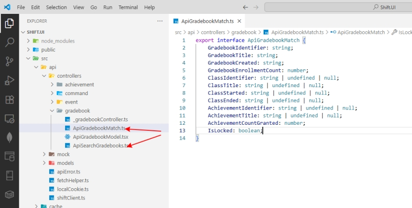
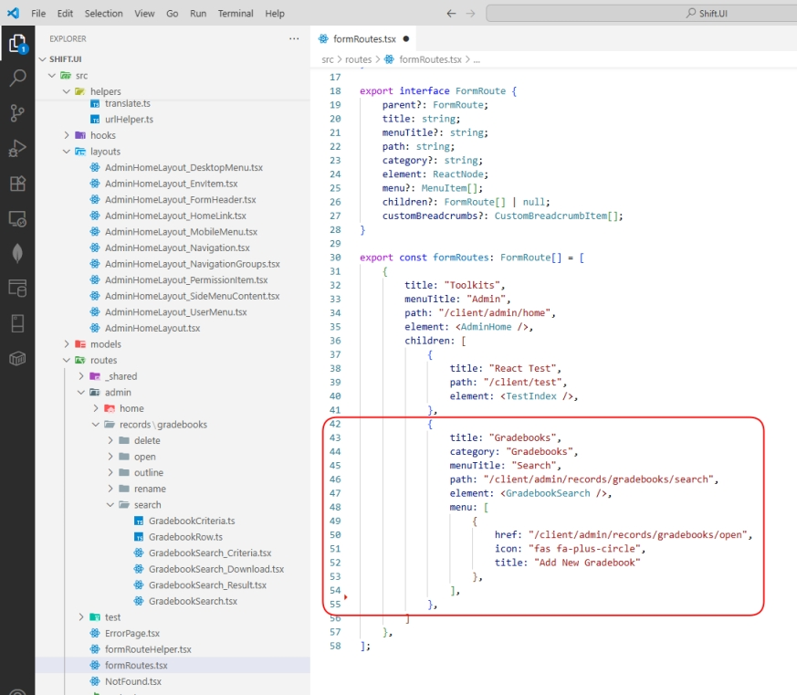

# The Search form creation process

I’ll be using Gradebook Search screen as an example

1. Create an interface for the API Row model (ApiGradebookMatch) and API Query model (ApiSearchGradebooks)\
   <figure><figcaption></figcaption></figure>
2. Add search and download methods to the controller object:
   <figure><figcaption></figcaption></figure>

3. Go to cacheKey.ts and add a new unique key to the union type CacheKey

4. Create a new folder /src/routes/admin/records/gradebooks/search\
   This folder will contain code related to Gradebook Search form

5. Create a new file GradebookRow.ts with interface GradebookRow and the function toGradebookRow\
   - GradebookRow provides properties used by Result Grid.
   - toGradebookRow converts ApiGradebookMatch to GradebookRow

6. Create a new file GradebookCriteria.ts with the interface GradebookCriteria and functions defaultGradebookCriteria and toApiSearchGradebooks

7. Create a new file Gradebook_Search.tsx and specify all criteria input field here

8. Create a new file GradebookSearch_Result.tsx and specify all Result Grid fields here

9. Create a new file GradebookSearch_Download.tsx and specify all download fields here

10. Create a new file GradebookSearch.tsx that joins Search, Result, and Download components.

11. Add a new Search form to routes in the file /src/routes/formRoutes.tsx:
    <figure><figcaption></figcaption></figure>