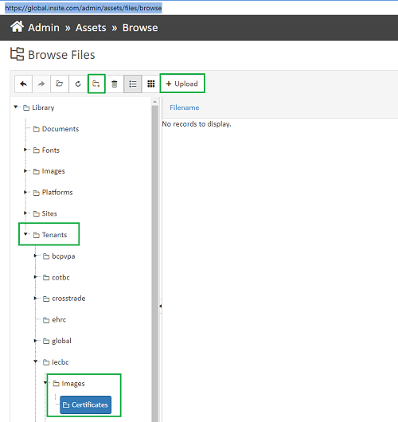

# Adding CertificateLayouts to Achievements

If a tenant wants to provide users with a downloadable certificate upon completion of a course, here is how that is set up:

1. Have Dev create the fillable certificate template from a tenant-supplied png or from our own templates (not sure how dev does this, but Dan did it for CPTBC's 2022 ASR Certificate).
2. Upload the .png file to [https://global.insite.com/admin/assets/files/browse](https://global.insite.com/admin/assets/files/browse), **tenant folder/images/certificates.** (Create the folders if needed, see pic below.)
3. Have Dev insert a config record in the **CredentialLayout** table in the database pointed to the uploaded template. (Future update: UI for the CredentialLayout table so dev not needed for this step.)
4. Create an achievement in **Records/Achievement Setup**, edit it to add the new certificate under **Credential Layout**, and make note of the achievement's unique identifier for step 6 if this will be linked to a v1 course lesson.
5. Create or edit a **gradebook** to link the achievement to the whole book (v2 courses only?) or a grade item (v1 or v2 courses). Separate grade items in the gradebook can have separate achievements too, if desired.
6. Hook the gradebook item to the desired course asset using the **Hook/Integration Code** feature. Most v1 courses also have a final "Print your certificate" lesson of some kind with a link for the user to download their certificate. Suggested body content for this lesson is:

   `<strong>` **** Click to here to access your certificate: `<a target="_blank" href="/ui/portal/records/credentials/certificate?achievement=1cf389d0-c924-4e40-a796-ae8501773fa1&type=html ">XYZ Certificate</a></strong`,

   where the number after the achievement is the unique identifier from step 4. The certificate will open in another tab if this html code is used in markdown.

If the tenant desires (usually if users could have a number of achievements year over year), a portal tile can be added that allows users to see all of their achievements and download the certificates for any that have them. Point the portal tile to: [/ui/portal/records/credentials/search](https://e02.insite.com/ui/portal/records/credentials/search).

<figure><figcaption></figcaption></figure>
