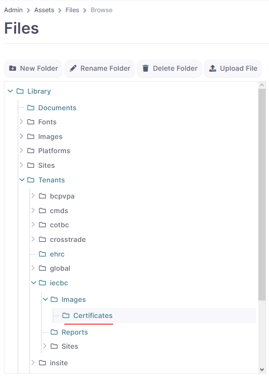
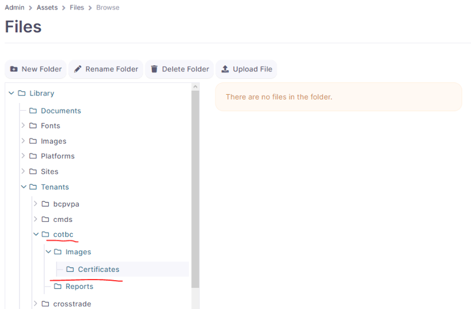
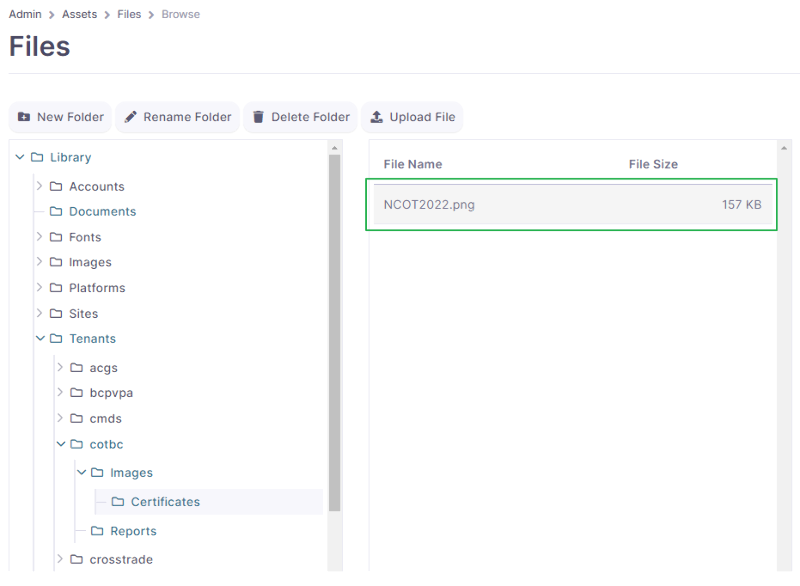

# Global tenant file upload

First of all wee need to upload our new Certificate Layout using global tenant to this location:

[https://e02.insite.com/ui/admin/assets/files/browse](https://global.insite.com/ui/admin/assets/files/browse)

Select Library → Tenants → \[desired tenant code] → Images (if not existing please create) → Certificates (if not existing please create)

Example for IECBC tenant

<figure><figcaption></figcaption></figure>

Example for COTBC tenant

<figure><figcaption></figcaption></figure>

We upload our desired background certificate layout in that location:

Example with COTBC tenant

<figure><figcaption></figcaption></figure>

To check if the background image is properly uploaded we follow this URL:

**https://\<environment>-\<tenant code>.insite.com/library/tenants/\<tenant code>/images/certificates/\<file name>.\<file extension>**

**Example COTBC:** [https://sandbox-cotbc.insite.com/library/tenants/cotbc/images/certificates/NCOT202022.png](https://sandbox-cotbc.insite.com/library/tenants/cotbc/images/certificates/NCOT202022.png)

***For best practices it is best to avoid special characters and space bars in file naming***

Once we are sure that the the image is correctly uploaded to the server we need to Configure Directly on the tenant admin page one more thing in the Admin Record pages.
