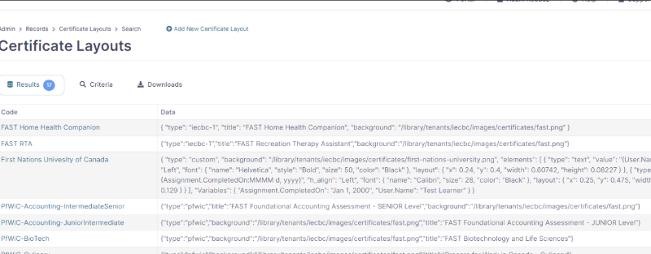
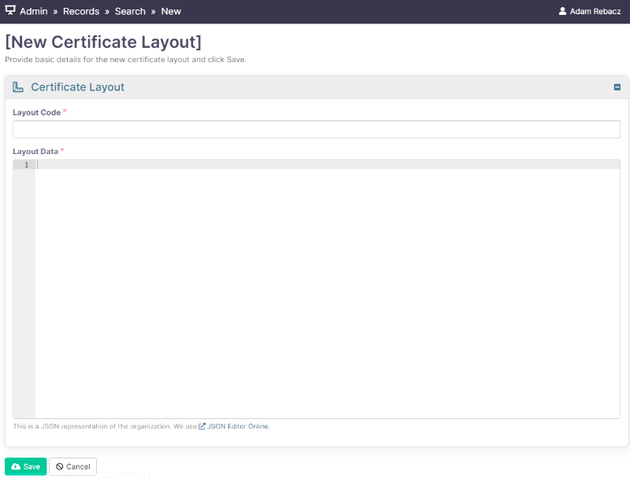
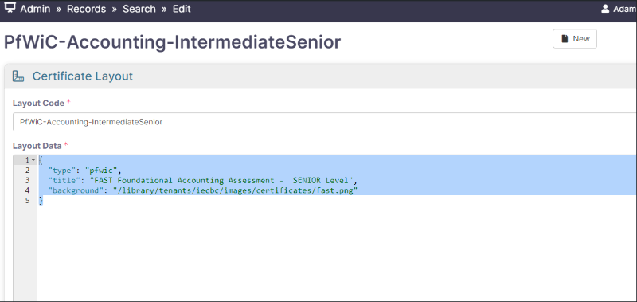
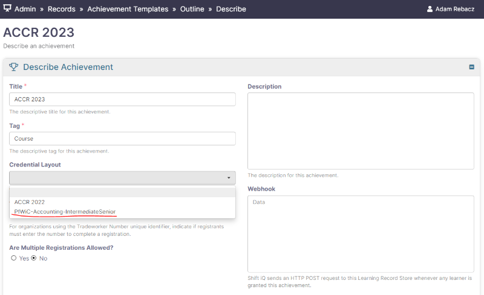

# How to configure a new certificate layout

Under our desired Tenant go to Records → Certificate Layouts

<figure><figcaption></figcaption></figure>

If you want to edit a layout then select a layout code, but if you want to create completely new layout then we should select '**Add New Certificate Layout**'. It looks scary but it is not.

<figure><figcaption></figcaption></figure>

Write the JSON for your new certificate. You need these properties: type, background, elements.

**Example of JSON Data:**

```json
{
  "type": "custom",
  "title": "2022 National Competencies for OTs in Canada",
  "background": "/library/tenants/cotbc/images/certificates/NCOT2022.png",
  "elements": [
    {
      "type": "text",
      "value": "{User.Name}",
      "h_align": "Center",
      "font": {
        "name": "Helvetica",
        "style": "Bold",
        "size": 90,
        "color": "Black"
      },
      "layout": {
        "x": 0.2,
        "y": 0.47,
        "width": 0.60742,
        "height": 0.08227
      }
    },
    {
      "type": "text",
      "value": "on {Assignment.CompletedOn:MMMM d, yyyy}",
      "h_align": "Left",
      "font": {
        "name": "Calibri",
        "size": 80,
        "color": "Black"
      },
      "layout": {
        "x": 0.43,
        "y": 0.74,
        "width": 0.644,
        "height": 0.129
      }
    }
  ],
  "Variables": {
    "Assignment.CompletedOn": "Jan 1, 2000",
    "User.Name": "Test Learner"
  }
}
```

**JSON Configuration explanation:**

**Type:** "custom" - so that the system knows we are dealing with custom layout and we will assign values like user full name or date.

**Title:** Add the "title" of our custom Certificate layout

**Background:** Add the URL for our certificate "background" E.g. `/library/tenants/cotbc/images/certificates/NCOT2022.png` - always check if the image of the URL is correct

**Elements:** - here is a bit complicated structure so the best thing is to copy paste it all together and just change desired values:

```json
{
      "type": "text",
      "value": "{User.Name}",
      "h_align": "Center",
      "font": {
        "name": "Helvetica",
        "style": "Bold",
        "size": 90,
        "color": "Black"
      },
      "layout": {
        "x": 0.2,
        "y": 0.47,
        "width": 0.60742,
        "height": 0.08227
      }
    },
```

First part/section of elements as we is is of type text and it's value will be user name - it will be pulled directly out from our system. We se that the alignment will be center. We can specify the font face like Arial or Helvetica, font style for example Italic, Bold, Normal. The layout section will describe the x and y position on the generated certificate. This is a bit of test and see type of situation. change values and generate sampled certificate to see it the alignment is correct.

```json
{
      "type": "text",
      "value": "on {Assignment.CompletedOn:MMMM d, yyyy}",
      "h_align": "Left",
      "font": {
        "name": "Calibri",
        "size": 80,
        "color": "Black"
      },
      "layout": {
        "x": 0.43,
        "y": 0.74,
        "width": 0.644,
        "height": 0.129
      }
    }
```

Second part is about time of completion. The structure is exactly the same as the first part. Here we just describe the date time element value font size face and position. If we want to add additional values we need to confirm with dev team what other values can we present on Certificate layout.

<figure><figcaption></figcaption></figure>

**Insert a new record in the Certificate Layout table (achievements.TCredentialLayout) - deprecated**

Edit the Achievement in the Records toolkit, and select the new Certificate Layout.

After we successfully added our new Certificate Layout we should be able to edit our desired Achievement Template with a Drop Down selection

<figure><figcaption></figcaption></figure>

The URL in the Portal to view your certificate for a achievement looks like this:

**/ui/portal/records/credentials/certificate?achievement=f44dbb20-6916-4733-be3d-ae9900eb1b0f\&type=html**

Notice the GUID is the Identifier for the Achievement Setup in the Records toolkit.
