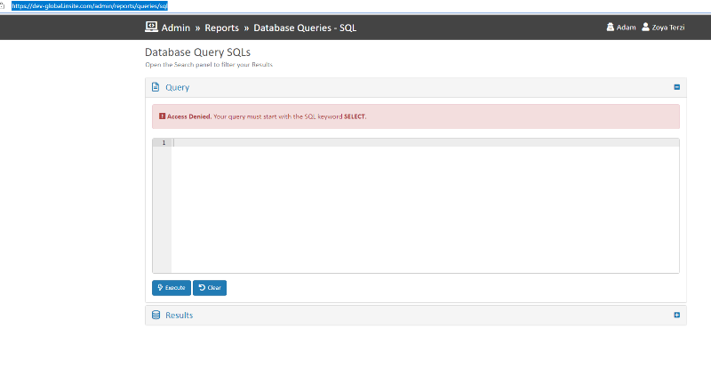
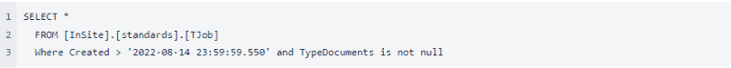
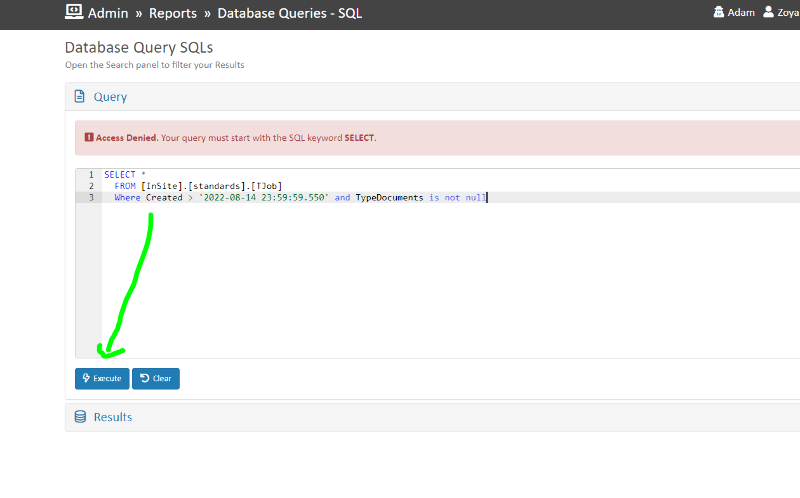
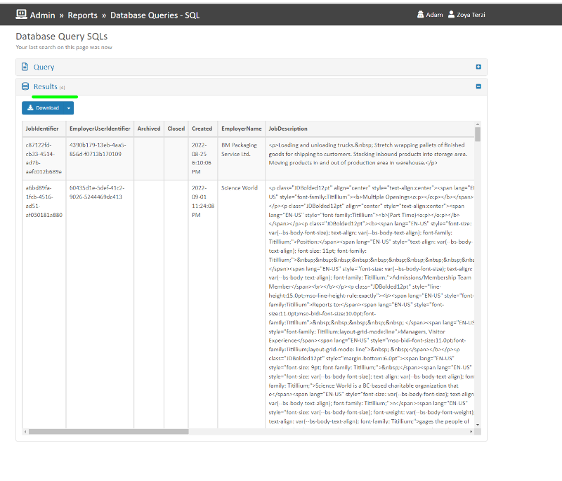
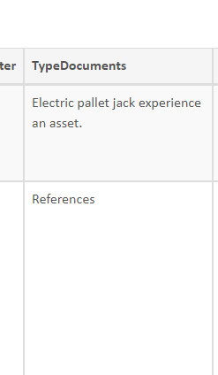
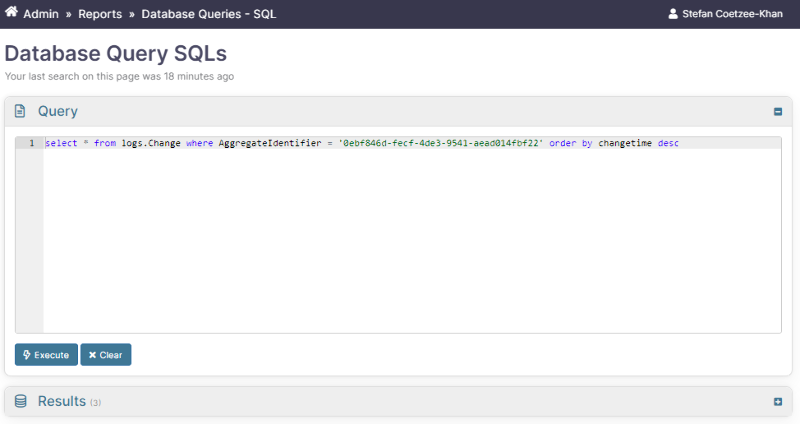

# Queries

## Dynamic SQL Query

Go to: (depending on the environment):

* [https://global.insite.com/admin/reports/queries/sql](https://global.insite.com/admin/reports/queries/sql)
* [https://sandbox-global.insite.com/admin/reports/queries/sql](https://sandbox-global.insite.com/admin/reports/queries/sql)
* [https://dev-global.insite.com/admin/reports/queries/sql](https://dev-global.insite.com/admin/reports/queries/sql)

You should see something like this:

<figure><figcaption></figcaption></figure>

In the large Text Area insert the SQL Code:

<figure><figcaption></figcaption></figure>

And click Execute

<figure><figcaption></figcaption></figure>

Results for the SQL Query will display in the Results panel.

<figure><figcaption></figcaption></figure>

If you scroll right you will notice column names:

<figure><figcaption></figcaption></figure>

To download the Query results, click on the **Download** button in the **Results** panel.

### Example: Assessment Attempts

```sql
select * from logs.Change where AggregateIdentifier = 'INSERT ASSESSMENT ATTEMPT UNIQUE IDENTIFIER' order by changetime desc
```

OR

```sql
select * from logs.Change where AggregateIdentifier = 'INSERT ASSESSMENT ATTEMPT UNIQUE IDENTIFIER'
```

<figure><figcaption></figcaption></figure>
