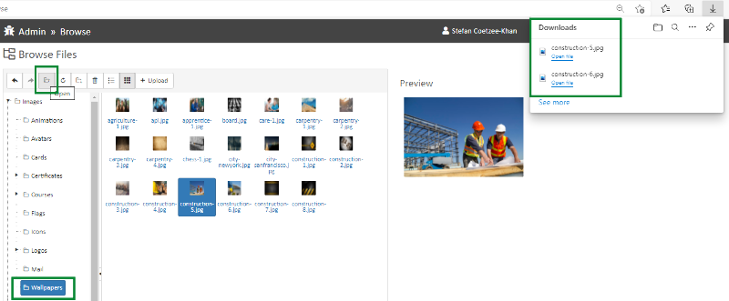

# Sites

## Support Page

Here are the steps to customize the text on the support page:

1. Open the **Sites** toolkit and select the **Sites** counter.
2. Select the **Title** for the **Portal**.
3. Create a new **Page**, under the **Root**, called **Support Page**.
4. Under the **Page Setup** tab, rename the **Page Slug (URL Segment)** to **support**.

To Customize the summary on the Support page, add text to the Summary tab of the page in Sites.

To add customized text on the Support page, add text to the Body tab of the page in Sites.

## Wallpaper Images

If you want to use one of the existing wallpaper images for a portal tile, go to:\
[https://global.insite.com/admin/files/browse](https://global.insite.com/admin/files/browse) and select **Wallpapers**

There is no download option; if you want a copy of one of the image files there, click on it and choose the Open button. The image you selected will download to your download folder.

<figure><figcaption></figcaption></figure>
