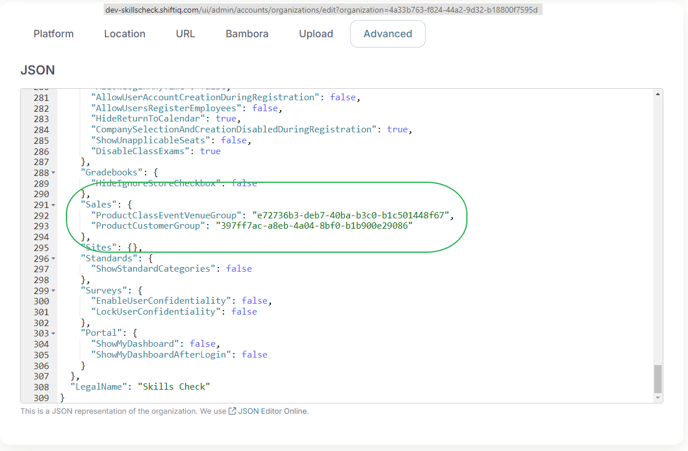

# SkillsCheck — steps for publishing a course/product to the skillscheck.ca web page

**Organization Settings:**

1. When an Class is created the Venue is one of the required fields during setup. Since SkillsCheck Courses/Assessments are online, we created a Venue called [Online Course](https://dev-skillscheck.shiftiq.com/ui/admin/contacts/groups/edit?contact=e72736b3-deb7-40ba-b3c0-b1c501448f67) and this Venue will be added for all classes being created from the SkillsCheck webpage. The group GUID needs to be added under the advanced Organization settings next to `"ProductClassEventVenueGroup"` .
2. The purchaser needs to be added to a admin role with permissions to see the instructor's gradebook. Create a group with the appropriate permissions and add the The group GUID needs to be added under the advanced Organization settings next to `"ProductCustomerGroup"`. All users creating an account from the SkillsCheck webpage will be added to the group.

```json
"Sales": {
  "ProductClassEventVenueGroup": "e72736b3-deb7-40ba-b3c0-b1c501448f67",
  "ProductCustomerGroup": "397ff7ac-a8eb-4a04-8bf0-b1b900e29086"
  },
```

<figure><figcaption></figcaption></figure>

**Course/Assessment/Group creation instructions:**

1. Create the Course
2. Attach a Gradebook to the Course
   1. Note:  If a Gradebook isn't attached to the course, it will not be available to be selected when creating the product for the SkillsCheck web page.
3. Create a Group with the same name as the Course
   1. _**Example:**  Course Name = **Carpenter: Window Framing** so then the Group Name = **Carpenter: Window Framing**_
   2. Group Type = Role
   3. Group Tag = Course
4. Publish the Course to the Portal and add the Group to the Privacy of the Course
   1. Adding the Privacy for the course needs to be done from the Sites toolkit after Course has been published.
5. Create the Product in the Sales toolkit.
   1. Add Product Name = Same as the Course/Group name
   2. Add Description
   3. Select the Course tied to the Product
   4. Add the Price for the product
   5. Add Product Image
   6. Save changes
6. Publish Product to Web page when ready.


**IMPORTANT NOTE:**

The Course, Group and Product names should all match. Example:\
**Course Name:**  Indoor Painter\
**Group Name:**  Indoor Painter\
**Product Name:**  Indoor Painter


Dev tasks for SkillsCheck:

* [DEV-8651](https://insite.atlassian.net/browse/DEV-8651) - Implement Skills Check (Closed)
