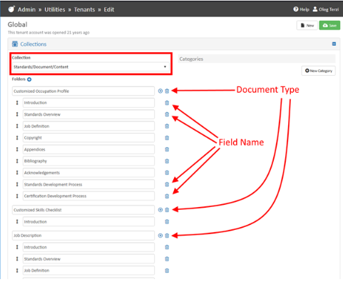
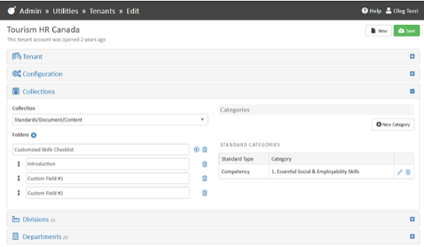
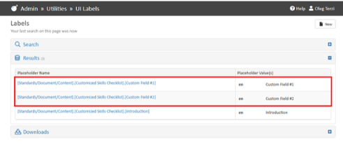

# Define custom fields for standard output document headers

Global admins can modify the content fields of Document module on _admin/utilities/tenants/edit_ screen in _Collections_ section for a specific tenant if needed. The _Standards/Document/Content_ collection of Global tenant contains the default fields used when a new tenant is created:

<figure><figcaption></figcaption></figure>

Global admins can override the default items for each tenant. Open the Collections panel in the tenant you want to edit and define new collections.

<figure><figcaption></figcaption></figure>

Go to the Utilities/Labels table and add labels for your new fields:

<figure><figcaption></figcaption></figure>
