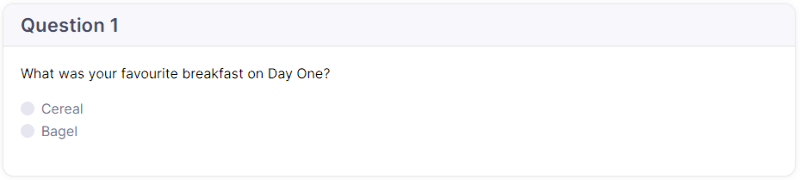

# Survey content font colours

How to change the font color of the **Answer Options** in an **Survey**:

* Open the **Survey** and click on the **Content** tab.
* Under the **Page Header** tab, click the **Edit** button.
* Add the following code:

  ```css
  <style>
  .form-check-label { color: black; }
  </style>
  ```
* You can change the color by typing the color name (e.g. black, red, blue) or adding the HTML color code (e.g. #060606, #F90F0F, #0F0FF9) after "**color:**".
  * For example: `color: blue` or `color: #060606`
* Click **Save.**

<figure><figcaption></figcaption></figure>

> **Please note:** Adding this code to the survey will change the color for **all** answer options in the survey.

How to change the font color of the **Question Text** in a **Survey**:

* Open the **Survey** and under the **Questions** tab, click the Pencil icon next to the question you want to change the font color for.
* Add the following code in the **Question Text** field:\
  `<span style="color:black">add text here</span>`
* Add your question text between `"color:black">` and `</span`
* You can change the color by typing the color name (e.g. black, red, blue) or adding the HTML color code (e.g. #060606, #F90F0F, #0F0FF9) after "**color:".**
  * For example: `color: blue` or `color: #060606`
* Click **Save.**

<figure><figcaption></figcaption></figure>

<figure><figcaption></figcaption></figure>
