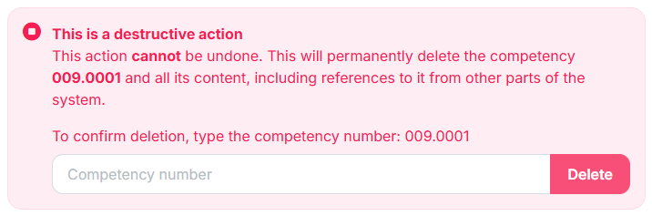

# Version numbers

This is the convention for version numbers on all software package builds, upgrade scripts, in the platform. It guarantees a unique version number regardless of where the build is packaged (e.g., in a development environment or in a CI/CD build environment).

## Major.Minor.Build.Revision

* Major = Two-digit year **plus** the release cycle number. For example, **251** is Year 20**25** Release Cycle **1**.
* Minor = Four-digit year from the build time. For example, **2025** means the year 2025.
* Build = Month and Day from the build time. For example, **0205** means February 5.
* Revision = Hour and Minute from the build time. For example, **2359** means 12:59 PM UTC.

Here is a complete example:

* **Version 251.2025.205.2359**

This version was built on February 5, 2025 at 12:59 PM UTC for Release #1 in 2025.

## Release numbers in Git and Jira

The release number for a production deployment follows this convention:

* v25.1

The release number for hotfix deployments should follow this convention:

* v25.1a - This is the first hotfix release for version 25.1.
* v25.1b - This is the second hotfix release.
* v25.1c - This is the third hotfix release.

## Release numbers in Sentry

The Release number in a message submitted to Sentry includes only the first 3 segments (Major.Minor.Build). Segment 4 is not necessary in this context, because multiple deployments to a given environment are not needed within any 24-hour period.&#x20;

This improves the readability and management of Sentry issues. Also, it enables us to mark an issue “Resolved until next release”, which fits with our daily automated deployments to Development and Sandbox.

<figure><figcaption></figcaption></figure>

Here is a code sample to show how this is achieved:

<figure><figcaption></figcaption></figure>
