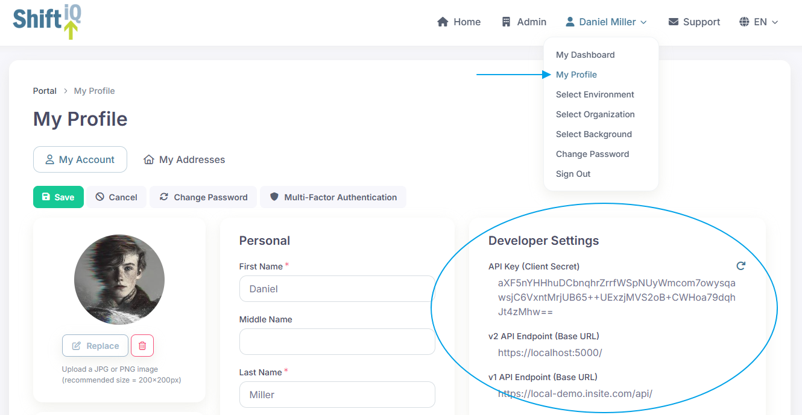
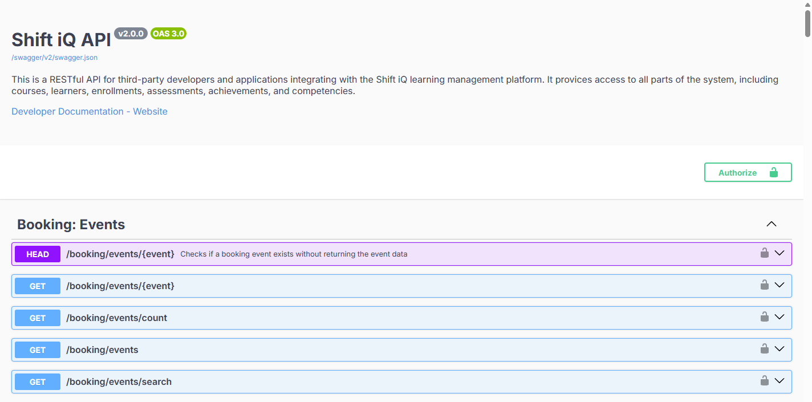

# Introduction

## Authentication

Your developer API key is available on the My Profile page for your account.&#x20;

Simply sign in and click here:

<figure><figcaption></figcaption></figure>

You can expire your API key and create a new key by clicking the Refresh icon at the top right.

The Base URL for the API endpoints is also displayed for reference. Please note the Base URL for the API is not identical for all organizations; remember to confirm your integration settings match the developer settings here before you send API requests from your application.

## OpenAPI Specification

The [OpenAPI Specification](https://www.openapis.org/) (OAS) provides a consistent means to carry information through each stage of the API lifecycle. It is a specification language for HTTP APIs that defines structure and syntax in a way that is not wedded to the programming language the API is created in. API specifications are typically written in YAML or JSON, allowing for easy sharing and consumption of the specification.

With OAS, you can quickly discover how an API works. As it is programming-language agnostic you can quickly identify and understand service capabilities. You can also use OAS to configure infrastructure, generate client code and create test cases for your APIs. OAS can therefore support your endeavors throughout the API lifecycle, and help you communicate with developer communities both inside and outside your organization.

The OAS for the Shift API looks like this:

<figure><figcaption></figcaption></figure>

The complete API Reference specification is available here for you to browse and explore. If you'd like to integrate the specification directly into your own application and/or CI/CD pipeline, you can also download the specification in JSON file format.

<table data-view="cards"><thead><tr><th align="center"></th><th data-hidden data-card-target data-type="content-ref"></th><th data-hidden data-card-cover data-type="files"></th></tr></thead><tbody><tr><td align="center">API Reference</td><td><a href="https://dev-api.shiftiq.com/v2/e01/swagger/">https://dev-api.shiftiq.com/v2/e01/swagger/</a></td><td><a href="../.gitbook/assets/v2-03.png">v2-03.png</a></td></tr></tbody></table>
