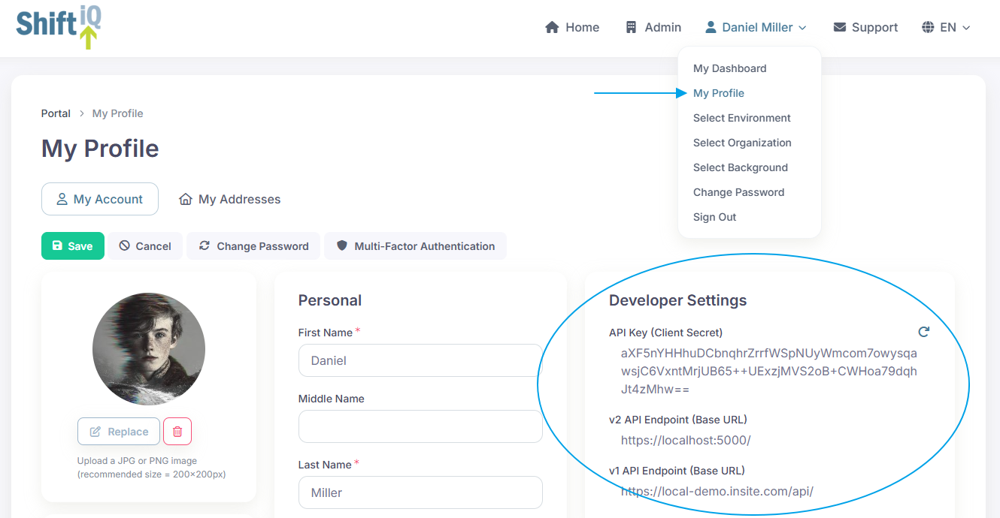

# Introduction

Version 2 of the API is a more comprehensive programming interface, providing developers and integrators with access to every part of every subsystem throughout the platform.


**Version 2 is a Beta release and is therefore subject to change.**

We'll post updates as they become available. If you'd like to join our beta program, then please [contact our service and support team](mailto:support@shiftiq.com) to have your developer account enabled. We'd love to get your feedback.


## Authentication

For details on API keys, bearer tokens, and other authentication methods, see [Authentication](authentication/).

<<<<<<< HEAD
Your developer API key and Base URL are available on the My Profile page under Developer Settings. Please note the Base URL is not identical for all organizations; confirm your settings match before sending API requests from your application.
=======
Login, click your name at the top right, and click **My Profile**:
>>>>>>> a79231eeaf81b8e914cfd8643177ed4c1e85f06e

<figure><figcaption></figcaption></figure>

## OpenAPI Specification

The API is described using the [OpenAPI Specification](https://github.com/OAI/OpenAPI-Specification) (OAS), a language-agnostic standard for documenting HTTP APIs. You can use the OAS definition to explore available endpoints, generate client code, and integrate the specification into your CI/CD pipeline.

The OAS for the Shift API looks like this:

<figure><figcaption></figcaption></figure>

Browse the full specification via the API Reference link below, or download it as JSON for use in your own applications.

<table data-view="cards"><thead><tr><th align="center"></th><th data-hidden data-card-target data-type="content-ref"></th><th data-hidden data-card-cover data-type="files"></th></tr></thead><tbody><tr><td align="center">API Reference</td><td><a href="https://dev-api.shiftiq.com/v2/e01/swagger/">https://dev-api.shiftiq.com/v2/e01/swagger/</a></td><td><a href="../.gitbook/assets/v2-03.png">v2-03.png</a></td></tr></tbody></table>
