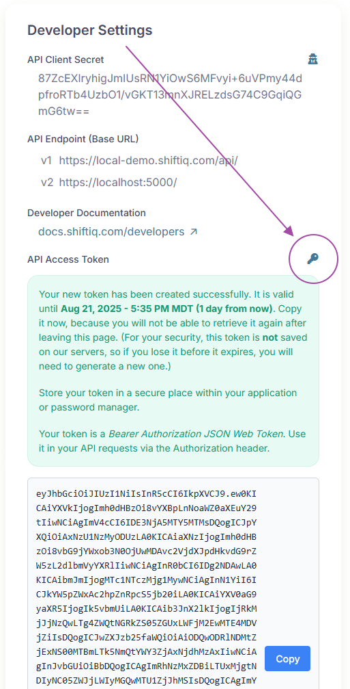
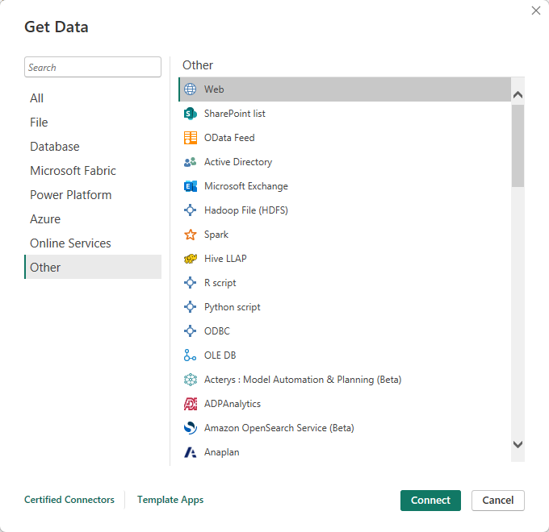
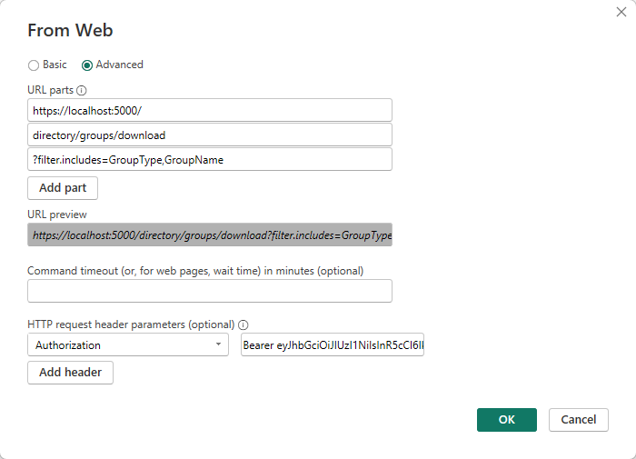
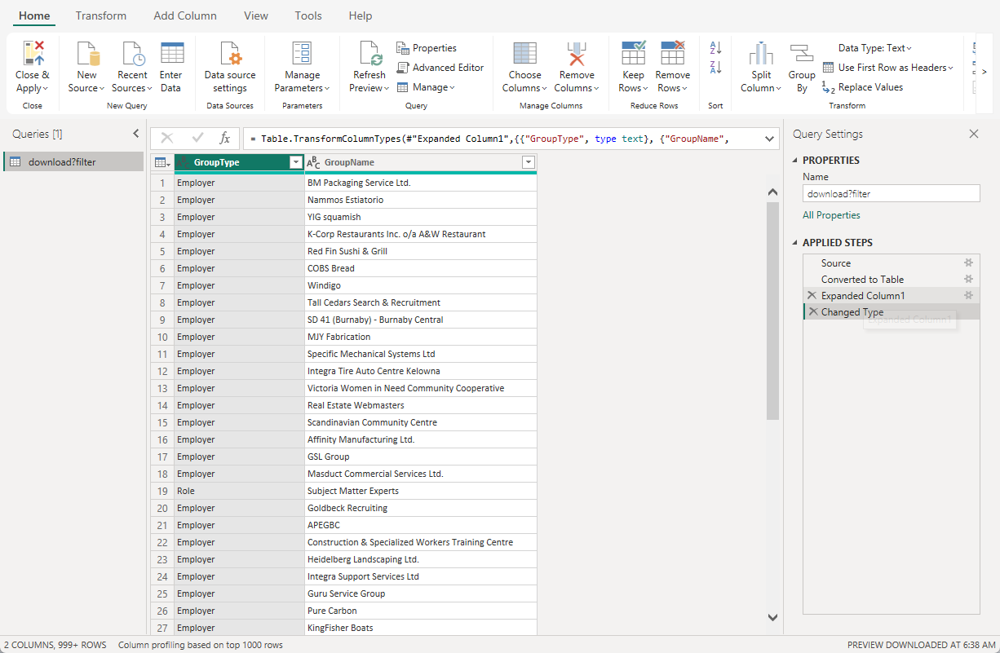

# Power BI

Power BI is Microsoft's business intelligence and data visualization platform. In simplest terms, it is a report builder — and a very good one. It is designed to make reporting accessible to business users, not just technical experts.

Many of our customers use Power BI to extract, analyze, and report data from the system. Here is a quick guide to help you get started.

## Overview

The API uses [Bearer authentication](https://swagger.io/docs/specification/v3_0/authentication/bearer-authentication/) to secure access to the data in your account.

This means you'll use Bearer token authentication to prove that Power BI has permission to access your data, whenever you connect Power BI to the API as a data source.

**What is a bearer access token?** A bearer access token is like a digital key that the API provides to authorize access to your data. Think of your access token as a temporary pass that says "whoever has this token is allowed to read my data."

**How it works with Power BI:**

1. You sign in as a Shift iQ developer, integrator, or administrator, and generate your own private access token.
2. When you set up your data connection in Power BI, you'll enter this token in the authentication settings.
3. Power BI will then use your token to identify itself to the API each time it needs to refresh your data.

## Step 1: Make sure your developer account is enabled

If you are working with the API for the first time, then always start in the Development environment.&#x20;

Sign in and visit the My Profile page. If you account is enabled for development and integration with the API then you'll see a Developer Settings panel here. It looks something like this:

<figure><figcaption></figcaption></figure>

If you do not see a Developer Settings panel then contact your LMS administrator to have this enabled for your account.

## Step 2: Generate an access token from your client secret

To generate an access token, visit the My Profile page. In the Developer Settings section, click the key icon. The system creates a token that you can copy to your clipboard with a single mouse-click.

<figure><figcaption></figcaption></figure>

## Step 3: Create a data source in Power BI

Start the Power BI Desktop app on your computer and create a new report.&#x20;

When you are prompted for a data source, select "Get data from another source".&#x20;

In the "Get Data" dialog box, select "Web".

<figure><figcaption></figcaption></figure>

In the "From Web" dialog box, select "Advanced" and input the settings for your URL parts and your HTTP request header.

#### URL parts

You can input the entire fully qualified URL for an API endpoint as a single URL part, or you can separate the URL into logical "parts" so it is easier to read and understand. Our team prefers the latter, but of course this is optional. In the example below, you'll see:

* In the first part we identify the base URL for the server where the API is hosted. This is copied directly from your Developer Settings.
* In the second part we identify the specific query that we want to send.
* In the third part we specify any additional options or input parameters for the query.

#### HTTP request header

* In the first text box, enter the parameter name "Authorization".
* In the second text box, enter the parameter value. This is the word "Bearer", followed by a blank space, followed by your access token.

Here is an example for reference:

<figure><figcaption></figcaption></figure>

Click "OK", and your data source is ready to use.

<figure><figcaption></figcaption></figure>
