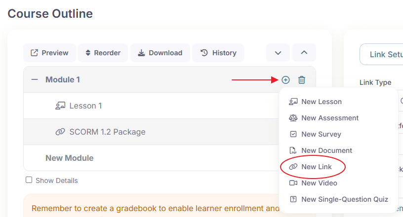
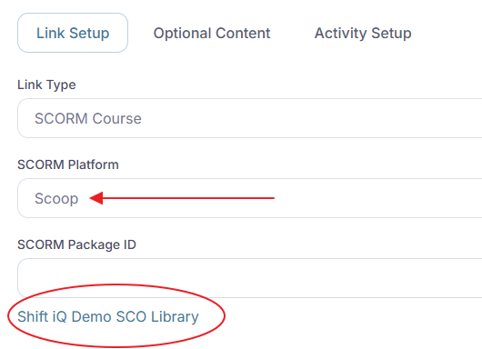

# Adding SCORM content to a course

Adding a SCORM package to a course in Shift iQ is a simple three-step process.&#x20;

Step 1. Add a Link activity to a module in your course.

<figure><figcaption></figcaption></figure>

Step 2. Select the option to use "Scoop" as your SCORM Platform.

If an SCO library is not already created for your organization, the system will create it automatically, and display a link to the library.

Click the link to open your SCO library.

<figure><figcaption></figcaption></figure>

Step 3. Upload your SCORM package.

Click the button to choose a file on your computer, and click the button to add your SCORM package to your library.

<figure><figcaption></figcaption></figure>

The system will generate a SCORM package identifier for you automatically. It converts the name of your file to lowercase, and replaces non-alphanumeric characters to hyphens. This ensures the identifier is web-friendly. Copy this to your clipboard.

<figure><figcaption></figcaption></figure>

Step 4. Paste the SCORM package identifier into the field labelled "SCORM Package ID".

<figure><figcaption></figcaption></figure>

Step 5. Save your changes, preview the course in Shift, and click the Launch button to confirm your content is displayed.

