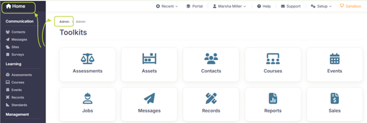
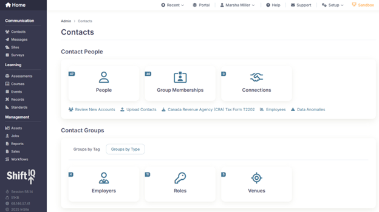
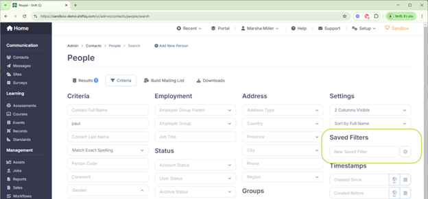
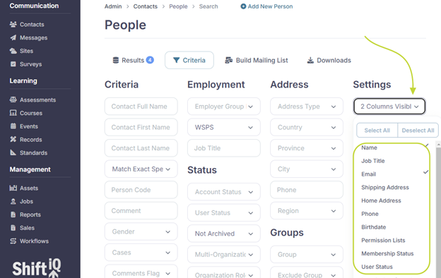
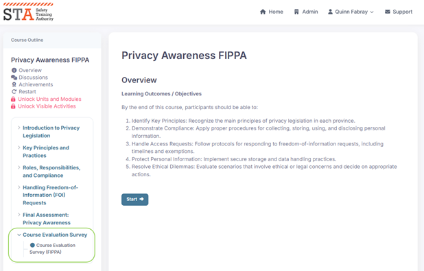
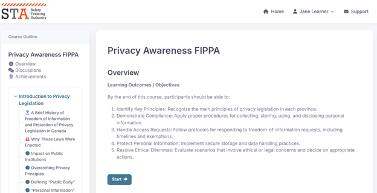

# Administrator experience

## Getting started

Open a new web browser window and go to the login page for your Sandbox version. For example:

* [https://sandbox-safetytraining.insite.com](https://sandbox-safetytraining.insite.com/ui/lobby/signin)

Sign in with the email address and password for an administrator. For example:

* administrator@example.com
* SuperSecretPassword1234!

## Sample organization setup: Safety Training Authority

Our team has configured a sample organization for demo and training purposes. You can use this to familiarize yourself with the system and experiment with various features.

The sample organization is named Safety Training Authority (STA).

## Overview

Admin level dashboards contain everything needed to quickly view critical information and shortcuts to access tasks and activities. And just like the learner dashboard, the admin dashboard is a persistent, synchronous environment, meaning information presented to learners appears in real-time and is always up to date.&#x20;

> Administrator Note: Email notifications are disabled in all Sandbox environments.

## Navigate Home

Return to the home screen at any time by clicking the Home button, or **Admin** on the breadcrumb trail. Navigate to any toolkit by clicking on the left menu OR on the tile on the main admin work area.

<figure><figcaption></figcaption></figure>

Shift iQ is delivered using role-based access control, meaning different features, functionality and information is displayed to administrators based on their on the permissions and roles in the system.

## Search for Data

When you click on a toolkit, you're presented with tiles showing the different types of data available there. For example, the **Contacts** toolkit shows that there are 36 **People**, 17 **Employers**, 9 **Roles** (Permissions), etc.

<figure><figcaption></figcaption></figure>

Click the **People** card to start exploring.

The **People** -> **Search** page has a tab for search **Criteria** and search **Results**. This page is powerful for searching for anything related to a person. Note: If you have a set of search criteria that you use regularly, you can save it to be used again and again.

<figure><figcaption></figcaption></figure>

Try searching for all **People** associated with the **Safety Training Employer**. On the People Search **Criteria** page, click on the **Group** field and select **Safety Training Employer**. Click on the **Search** button at the bottom of the screen.&#x20;

You can see on the **Results** tab that there are currently 33 people associated with that employer.

View more columns by selecting which ones you want on the Criteria tab.

<figure><figcaption></figcaption></figure>

Form the search results tab, edit a person to view all the information the system has about him. This is called the Person Record. From the person record you can:&#x20;

* View and edit contact information and edit profile picture
* Assign unique ID's
* Assign employers, titles, interests
* Configure custom fields
* Attach documents
* Comment on the person (private to admins)
* View their groups and Roles. Roles are linked to permissions and limit what a person can see.
* View Records, including Grades, Logbooks, Class Registrations, Achievements, Survey responses, and Outcomes.
* Manage System Access, permissions, multi-factor authentication, password resets, and user impersonations.

## Managing Training & Users

### Adjust user roles and assign a user to a group

In Shift iQ, everything a user sees is determined by what **Role** they're assigned to. A **Role** is simply a permission list. **Roles** can be configured in the **Groups** section of the **Contact** toolkit (View Groups by Type not Groups by Tag). From here you can see who is assigned to each role.

### Assign groups to a course

SUGGESTED ACTIVITY: See how to bulk assign training by assigning a group to a Course

Create a group named **AHRI Learners**:

1. Log in as an administrator
2. In the **Contacts** toolkit, select **Groups**, then **Add New Group** (at the top)
3. Add One new group named AHRI Learners; select **List** as the Group Type
4. Save

Add people to your new group:

1. When editing the group, click the **Add People** button
2. Select several people and click **Add**
3. Save

Assign the _Job Candidate_ group to the **Privacy Awareness FIPPA** course:

1. From the admin screen of the lefthand menu, select Courses
2. Filter for and edit the Privacy Awareness FIPPA course
3. Under the Course Setup tab, click the Enrollments sub-tab
4. Under the **Group** dropdown list, select the **AHRI Learners** group
5. Click the + to add everyone in the **AHRI Learners** group to the course

Assign registrants to a class:

1. From the admin screen of the lefthand menu, select **Events**
2. Filter for and edit the Privacy Awareness FIPPA class
3. Under the Course Setup tab, click the Enrollments sub-tab
4. Click **Add Person** to add someone to the class

Process cancellations:

* Administrators can manually override class registrations.

SUGGESTED ACTIVITY: Remove a learner’s registration from the Privacy Awareness FIPPA course.

* [ ] From the admin screen of the lefthand menu, select Events
* [ ] Edit the Privacy Awareness FIPPA course
* [ ] Under the Registrations tab, click the trash icon beside the registration you would like to remove. Note, administrators are always warned when deleting system data.

## Content Creation & Organization

Access documentation related to course creation here: [www.shiftiq.com/help/courses](https://www.shiftiq.com/help/courses)

The Courses toolkit can be used to deliver traditional courses; they can also be used to bundle different activities. For example, you might create course modules that contain surveys, quizzes, assessments, videos, attachments, and other interactions. You can layer these together to create a learning journey that can be completed in a day or one that is intended to be completed over a longer period.

### Suggested Activity

Insert an additional assessment into the Privacy Awareness FIPPA course

* [ ] Search for **Privacy Awareness FIPPA** course in the **Courses** toolkit.
* [ ] On the Search Results tab, click on the course name to edit
* [ ] Under the Course Outline tab, add a new module (bottom of page)
* [ ] Select **New Survey**
* [ ] Give your module a name, and your survey a name.
* [ ] Select an existing assessment form. If you don’t want to create your own, **Course Evaluation Survey (FIPPA)** is a good one to choose
* [ ] Click **Save**
* [ ] Log into the portal as Jane Learner. User credentials are on page 2 of this guide.

Click on Course Catalogue -> Privacy Awareness FIPPA course to see the changes that you’ve made to the course and to try it out.

<figure><figcaption></figcaption></figure>

## Assessments & Certifications

### Adaptive logic

Learning paths can be configured so a learner follows a consecutive series of steps, or they can be configured such that some modules are locked until the learner fulfills certain criteria. For example, you can configure a course where a learner must take lesson 1, then do a test on that material. If they pass the test, they can skip Lesson 2 and complete the course. If they fail, Lesson 2 will unlock and the learner must complete that material to get their achievement.

### Suggested Activity

Configure the Privacy Awareness FIPPA course to follow the logic above.

* [ ] Edit the Privacy Awareness FIPPA course
* [ ] Edit Lesson 2 Why These Laws Were Enacted in the Module Introduction to Privacy Legislation
* [ ] On the Activity Setup tab, select Activity Completed in the New Prerequisite dropdown
* [ ] In the box below, select A Brief History…. This will tell the system to keep Why These Laws Were Enacted locked until the lesson before it has been completed.
* [ ] Save
* [ ] Log out and log back in as Jane Learner.  View the course to see the lock on the course outline
* [ ] Proceed through the learning activity to test

<figure><figcaption></figcaption></figure>

## Communication & Learner Engagement

Notifications and direct messages are configured in the Messages toolkit.

### Notifications

Notifications are sent automatically by the system based on system events, or configurable triggers. For example, you can create a notification and configure it to be sent upon different triggers on a course. Create a new notification by opening the Messages toolkit Click on the Notifications counter tile Click the Add New Notification link at the top of the page\
Create some sample content and save your notification.

### Attach your notification to a course.

From the admin home screen or the left hand menu, select the Courses toolkit Click on the Courses counter tile and edit a course Select the Notifications Setup tab and attach your notification to the course. The system will now automatically send the notification based on the criteria you have selected.

### Direct Messages

You can send a message directly to any system user through their contact record. To send a message to a contact: Search for the person you wish to email in the Contacts toolkit. On the Search Results tab, click on their name to edit them Under the System Access tab, click on the Send Email dropdown. Select Correspondence. From here you can select a template from the list or create a new message from scratch. Follow the prompts to send the message. Note, sending has been disabled in Sandbox. A complete history of changes to a contact including the dates of any messages sent and the content of those messages is available on the Person -> Details tab.

## Tracking & Reporting

### Key learner insights

From the admin home screen, Click on the Assessments tile Under the Attempts counter tile, click on the Ad Hoc Attempt Report link In the Exam Bank Framework search criteria box, select the Privacy Awareness (FIPPA) and click Search This will show an overview of all learners who have taken assessments based on this framework. Attempts: Shows learner scores, time it took to complete the assessment, and gives a pass/fail indicator Time Series: Shows what time of the day/week/month learners are interacting with your assessments Statistics: Shows average statistics for all learners interacting with that topic. Question Analysis: Gives detailed analysis of each question to allow you to determine the effectiveness of your assessment questions. Standards: Shows average scores for each competency in your framework. This can highlight the strengths and weaknesses of your training program. Note, you can also toggle this to a learner view to see this report by individual learner.\
Downloads: Download any of this data to share or for external analysis.

### View or Export learner records from the person record

From the admin home screen, click on Contacts tile Filter for and edit Jane Learner Select any option from the More Info dropdown to open the person detail report Scroll up to see the Print Training Records button Print to export a pdf of that learner's history

### View or Export learner records from the Gradebook

From the admin home screen, click on Records tile Click on the Gradebooks counter tile or the Learner Scores counter tile Select the gradebook that corresponds to the course for which you would like to pull scores. Note, Introduction to Statics has a lot of data to play with. The Learner Progress tab allows you to see progress through the learning material for each learner, along with their grades or achievement on each grade item. The Achievements tab will show when achievements were granted, and whether they are still valid. The Grade items tab will give an overview of the grade items you have set up. You can add, remove, or change the scoring settings of your gradebook here. Export records using the Summary List button
