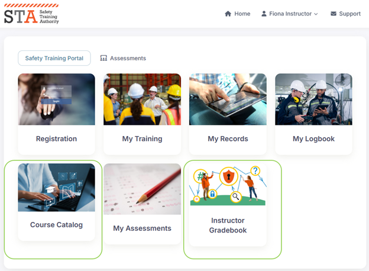
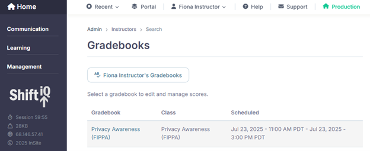
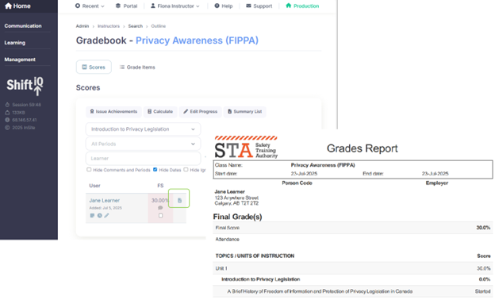
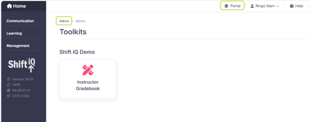

# Instructor experience

## Getting started

Open a new web browser window and go to the login page for your Sandbox version. For example:

* [https://sandbox-safetytraining.insite.com](https://sandbox-safetytraining.insite.com/ui/lobby/signin)

Sign in with the email address and password for an instructor. For example:

* instructor@example.com
* SuperSecretPassword1234!

## Sample organization setup: Safety Training Authority

Our team has configured a sample organization for demo and training purposes. You can use this to familiarize yourself with the system and experiment with various features.

The sample organization is named Safety Training Authority (STA). It is configured with an **Instructor Dashboard** that includes links to the **Course Catalog** and the **Instructor Gradebook**.

<figure><figcaption></figcaption></figure>

> Administrator Note: In the STA demo organization, this instructor is granted access to multiple areas of the system. The visibility of navigation cards on the dashboard is managed with role-based access permissions. For example, if you are assigned to a role with permission granted to an area of the system, then the launch card for that area is visible on your dashboard — otherwise it is not visible to you.

The **Course Catalog** displays the same information for an instructor that it displays for a learner.

### Instructor Gradebook

When you navigate to the **Instructor Gradebook** you'll see an administrative view of the system, with limited access to gradebook administration. For example:

<figure><figcaption></figcaption></figure>

An instructor can see an Instructor Gradebook for every course they teach. This limits their view to a confined learner population. Instructors can:

1. View completions and grades
   1. Click on the Instructor Gradebook tile and edit a Gradebook by clicking on its name.
   2.
      View results for all learners, or filter by learner or Lesson
2. Override completions and grades
   1. Click the Edit Progress button to override a grade or a completion status
   2. They can also make comments on learners, statuses or grades by unchecking the Hide Comments button.
3. Export lists of completions and grades
   1. Click the Summary List button to export these results to .xlsx format
4. View personal information of learners in their class, as well as achievements those learners have earned, other courses in which they are registered, and learning records associated with that learner.
   1. Click on the learner’s name to view records.
5. View scores for groups of learners scores on specific grade items by clicking on the Grade Items tab.
6. Print a Grade Report for each learner

<figure><figcaption></figcaption></figure>

Instructors can navigate back to the admin homepage by clicking the Home icon in the upper right or the Admin link in the breadcrumb trail.

They can navigate back to the portal by clicking on the Portal shortcut, or back to the My Dashboard view through the link in the dropdown menu under their name.

<figure><figcaption></figcaption></figure>
