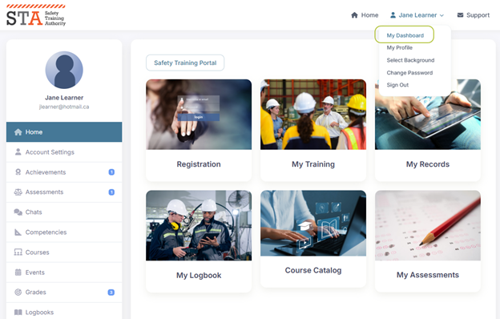
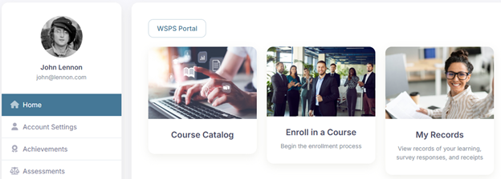
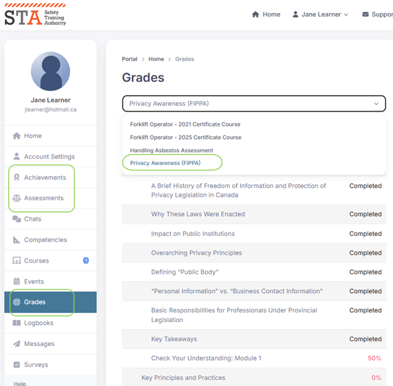

# Learner experience

## Getting started

Open a new web browser window and go to the login page for your Sandbox version. For example:

* [https://sandbox-safetytraining.insite.com](https://sandbox-safetytraining.insite.com/ui/lobby/signin)

Sign in with the email address and password for a learner. For example:

* learner@example.com
* SuperSecretPassword1234!


If you want to see what the user interface looks like from any mobile device, you can install this Chrome browser extension: [Mobile Simulator - Responsive Testing Tool](https://chromewebstore.google.com/detail/mobile-simulator-responsi/ckejmhbmlajgoklhgbapkiccekfoccmk?hl=en\&pli=1)


You can navigate to the Dashboard page any time by clicking your name at the top right. Select **My Dashboard** from the menu.

> Administrator Note: Your organization account can be configured so this page is the default home page for all your learners.

<figure><figcaption></figcaption></figure>

The navigation menu in the left panel provides learners with quick and easy access to everything they need.

## Sample organization overview

Our team has configured a sample organization for demo and training purposes. You can use this to familiarize yourself with the system and experiment with various features.

The sample organization is named Safety Training Authority (STA). It has several sample courses.  organization contains several  courses. A typical learner interacts with the course content by following a simple sequence of steps:

1. Browse the course catalogue
2. Enroll in a course
3. Complete learning materials and/or assessments
4. Download achievements from the dashboard

In addition to allowing your learners to browse your e-learning catalogue for self-directed online learning, you can also create a schedule of classroom training sessions and exam events  — which might be online or in-person — and allow your learners to browse the schedule and register for available seats.

Here, for example, here an administrator has published a library of online courses (Course Catalog) as well as event registrations (Enroll in a Course) in the learning portal:

<figure><figcaption></figcaption></figure>

Please note, in the STA demo organization:

* Courses are open for free browsing without a registration requirement.
* Notifications are disabled to prevent accidental delivery of email messages.
* E-commerce and online payment features are disabled for all courses except one. If you are interested to see the online payment process, then follow the registration steps for **JHSC Course 1 eLearning**.

## Explore courses

Here is a suggested activity to try for yourself:

* [ ] Click on the Course Catalog to browse available courses.
* [ ] Select Privacy Awareness FIPPA and proceed through the material. Ensure you complete the assessments for each module, as you can view the scores and reports for these later.
* [ ] Go to the My Dashboard view to look at your progress
  * [ ] On the Achievements tab, download your certificate or share it to social media
  * [ ] On the Assessments tab, view the results of your assessments
  * [ ] A complete list of completed Lessons and Assessments can be found on the Grades tab

<figure><figcaption></figcaption></figure>

## Explore class enrollments

Here is a suggested activity to try for yourself:

* [ ] From the **Home** tab, click the **Registration** tile
* [ ] Click either **Classes** or **Class Calendar** to initiate registration
* [ ] Click on the course name to start registration, select the **Self-Register** option
* [ ] Follow course registration through to the end. Test credit card details below:
  * [ ] Name: Anything
  * [ ] Number: 4030000010001234
  * [ ] Expiry: any future date
  * [ ] CVV: 123
* [ ] Go to the **My Dashboard** view to look at your progress
* [ ] On the **Events** tab, you can view the courses you are currently registered in. Click the View button for more information.
