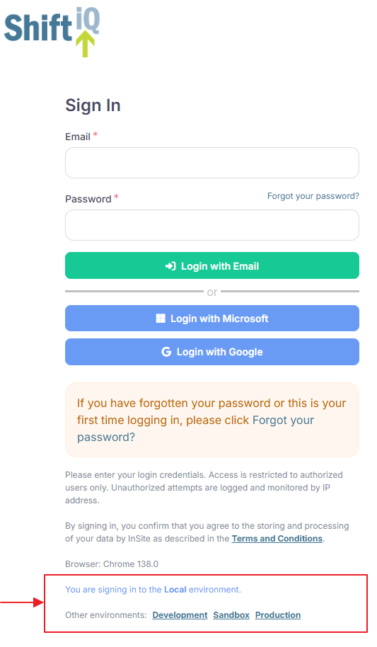

# How do I access my sandbox environment?

To access your sandbox environment, follow these steps:

1. Visit the Shift iQ website at [www.shiftiq.com](https://www.shiftiq.com/)
2. Click the Sign In link at the top of the page.
3. On the Sign In form, scroll to the bottom of the page.
4. You'll see an information message that reads, "You are signing in to the Production environment."
5. Below this, you'll see links to the other environments available for your organization. Typically, this includes Development and Sandbox.
6. Click the link for the Sandbox environment.
7. Copy the URL from your web browser's address bar.

For example:

<figure><figcaption></figcaption></figure>
