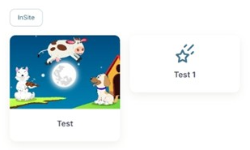

# Learning paths and programs

## Overview

Learning Programs allow you to bundle multiple training activities (courses, assessments, surveys) into structured learning paths. This guide will walk you through creating, configuring, and publishing programs that your employees can access through the learning portal.

***

## Creating a new program

### Step-by-step instructions

1. Open the **Records** toolkit and then click on the **Programs** tile under the Programs and Periods heading.
2. Click on the **Add New Program** link at the top of the page.
3. Fill in the required information:
   * Add a **Code** for the Program (**required**) - Enter a unique identifier
   * Add a **Name** for the Program (**required**) - Enter a clear, descriptive name
   * Add a **Description** for the Program (**optional**) - Add additional details
4. Click the **Save** button

> **💡 Tip**: Use clear, consistent naming conventions for program codes to make them easy to find and manage later.

***

## Adding program achievements

An Achievement can be granted to a learner when they have successfully completed a Program.

### Setting up a program achievement

1. **Access the Program Outline Page**
   * Navigate to the Program Outline page for your program
   * Look for the **Recognition** card
2. **Add the Achievement**
   * Select the achievement in the **Achievement** field in the Recognition card
   * If the Achievement you want to add is not on the list, the achievement still needs to be created. Refer to [define-achievement.md](../achievements/define-achievement.md "mention")
3. **Create New Achievement** (if needed):
   * Add the **Achievement Name** - What learners will see when they earn it
   * Add **Achievement Type** - Select the appropriate category
   * Select **Certificate Layout** if you want to grant learners a certificate at the end of the Program
   * Click the **Add Achievement** button

***

## Adding tasks to your program

On the Program Outline page, in the **Tasks** card, administrators can add the different tasks that will form part of the Program.

### How to add tasks

1. Click on the **Edit Tasks** button in the Tasks card
2. Add each task by selecting the checkbox next to the task
3. Click the **Save** button once all tasks have been selected

There are many different task types available:

**Assessments**

* Only **Published Assessment Forms** in Assessment Banks can be selected
* When selecting the checkbox next to the **Assessment Bank**, a list of all the Published Assessment Forms in that bank will be available for selection
* Select the checkbox next to each **Assessment Form** that needs to be included in the Program
* Multiple Assessment Forms can be added to one Program

**Standalone Achievements**

* _Please note:_ Adding a Standalone Achievement will not include its related activity.
* If the Achievement you want to add to the Program is not listed, the achievement still needs to be created. For details, refer to [define-achievement.md](../achievements/define-achievement.md "mention")

**Courses**

* Only **Courses with a Gradebook attached** will be available to select

**Logbooks**

* Available for selection when adding tasks to programs

**Surveys**

* Available for selection when adding tasks to programs

After you have added all your tasks to the program, click the **Save** button.

***

## Adding a program summary

In the **Content** tab on the Program Outline page, administrators can add a Summary for the program that will be displayed on the Portal.

### How to add a summary

1. Navigate to the Program Outline page
2. Click on the **Content** tab
3. Add your program summary in the provided field
4. This summary will be visible to learners on the Portal

***

## Publishing your program

After the Program is created, you need to **Publish** the Program to the **Portal** for users to access.

### Adding a program icon or image

**Program Icon**:

* Add the [**Font Awesome Icon**](https://fontawesome.com/icons) HTML code in the Program Icon field

**Program Image**:

* Click on the **magnifying glass (🔍) icon** next to the Upload New Program Image field
* Select the image you want to use for the portal tile

<figure><figcaption></figcaption></figure>

### Publishing the program to the learning portal

1. **Configure Portal Settings**:
   * In the **Web Portal** field, select your Portal URL
   * Select the **Web Folder** where the Program needs to be published to
   * Click on the **plus icon (➕)** next to the Web Page field to create the page URL
2. **Complete Publication**:
   * The Program is now Published to the portal
   * Click the **Save** button

### Task ordering

Administrators can determine in what order the selected Program Tasks appear on the portal to learners.

How to set the task ordering:

1. Under the **Publication** tab, click the **Task Ordering** tab
2. Review the order of the tasks in the Program
3. If you need to change the order, click on the **Reorder** button
4. **Drag and drop** each task in the required order
5. Click the **Save** button once completed

***

## Setting up email notifications

Administrators can configure **Progress Stalled** and **Progress Completed** notifications.

### Progress Stalled Notifications

Stalled notifications can be setup to send reminders to Learners and Administrators to complete the Program they started.

**Available Notification Options**:

**Send to Learner**:

* The stalled notification is sent to the Learner once they started the Program, but no progress has been made after a set amount of days

**Send to Administrator**:

* The stalled notification is sent to an Administrator to advise that a learner started the Program, but no progress has been recorded after a set amount of days

**Days Without Task Completion**:

* This is the number of days a learner can go without completing a task before the program is considered stalled

**Reminder Limit**:

* This is the maximum number of reminder notifications to send to a learner who is stalled

### Progress Completed Notifications

Once a learner has completed a Program, notifications can be sent to the Learner and Administrator to advise that they have completed the Program.

**Available Notification Options**:

**Send to Learner**:

* Add the notification you want to send to the Learner once they have completed the Program

**Send to Administrator**:

* Add a notification if you want to let an Administrator know when a Learner has completed the Program

**Send On Completion of this Task**:

* An administrator can select the task in the Program that is considered the last task that needs to be completed to consider the Program as Done

#### Saving Notifications

After notifications have been added, click the **Save** button.

***

## Enrolling learners

Learners need to be enrolled in a Program before they will be able to see any of the associated program Tasks.

### &#x20;Enrollment Process

1. **Access Enrollments**
   * On the Program Outline page, go to the **Enrollments** tab
   * Click on the **Add Learners** button
2. **Add Participants**
   * **Search for the Learner or Group** that you want to enroll in the Program
   * Once selected, click on the **Add** button
3. **Confirmation**
   * The Learner or Group that was selected will be enrolled into the Program and can access the Program on the Portal

***

## Tracking learner progress

Under the **Achievements** tab, administrators will be able to see all learners that completed the Program and that were granted the Program Achievement.

#### Viewing Achievement Data

1. Navigate to your program's Program Outline page
2. Click the **Achievements** tab
3. Review the list of learners who have completed the program
4. See when achievements were granted to each learner

This information is useful for:

* **Compliance Reporting**: Track mandatory training completion
* **Performance Reviews**: Document employee development
* **Program Evaluation**: Assess completion rates and program effectiveness

***

## Important notes and reminders

* **Assessment Requirements**: Only Published Assessment Forms in Assessment Banks can be selected for programs
* **Course Requirements**: Only Courses with a Gradebook attached will be available to select
* **Standalone Achievements**: Adding a Standalone Achievement will not include its related activity
* **Enrollment Requirement**: Learners must be enrolled in a Program before they can see any associated program Tasks
* **Publication Requirement**: Programs must be published to the Portal before learners can access them

***

_For additional support creating programs, contact your system administrator or browse the_ [_help center_](../../)_._
