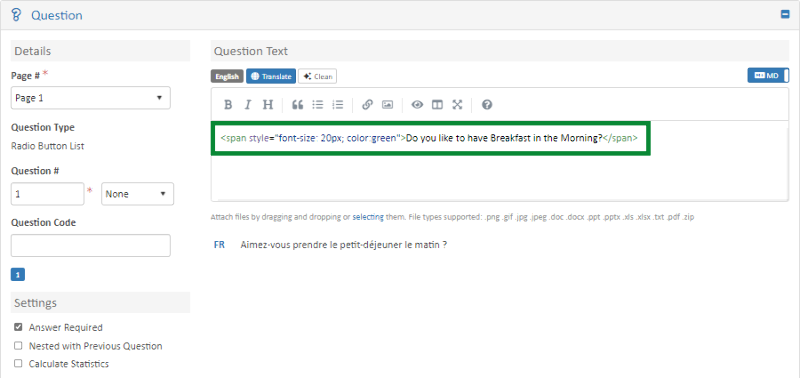
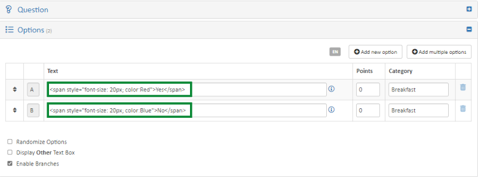
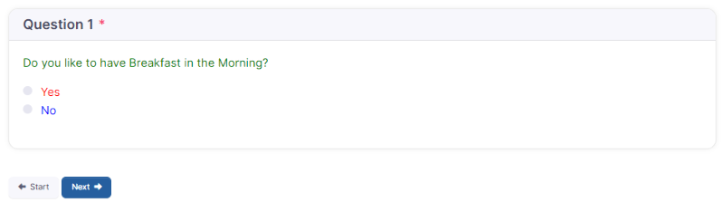
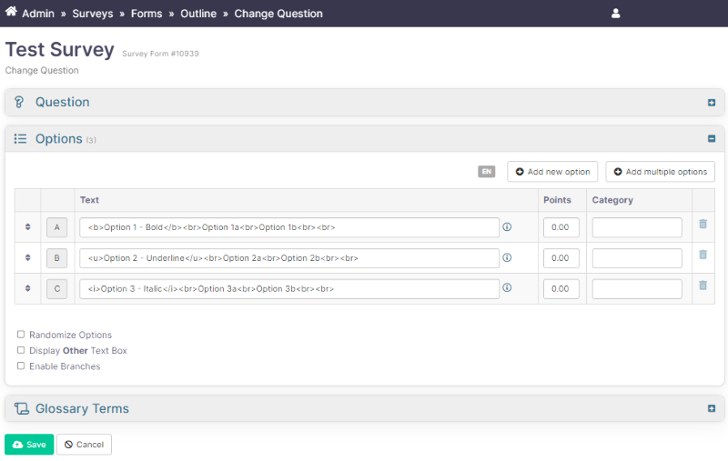
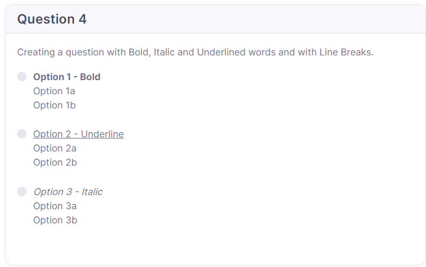
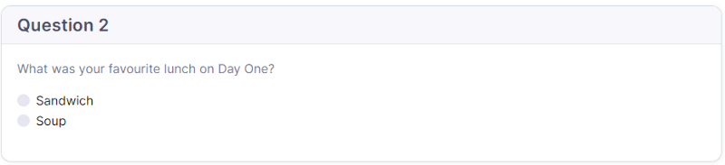
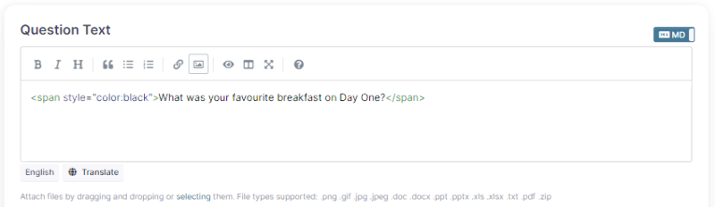

# Changing Fonts and Colors

## Changing Survey Question Text and Response Options Font and Color

The font and color in survey question text and response option text can be changed.

The HTML code needs to be added around the text as follows:

```html
<span style="font-size: 30px; color:green">insert text</span>
```

Instead of adding the Name of the Font (e.g. Green, Yellow, Blue, etc.) you are able to add the [HTML Color Code](https://html-color.codes/) (e.g. `#24ffff`, `#ff2424`, `#ffff24`, etc.).





The above will display as follows:



## Bold, Italic and Underline and Line Breaks for Survey Questions

You are able to add Line Breaks, Bold, Underline, and _Italicize_ sentences or words when adding answer options to a survey.

HTML code to **bold** a sentence or word — wrap with `<b>` and `</b>`:

```html
<b>This text is bold.</b>
```

HTML code to **underline** a sentence or word — wrap with `<u>` and `</u>`:

```html
The text is <u>underlined</u>.
```

HTML code to **italicize** a sentence or word — wrap with `<i>` and `</i>`:

```html
The text was <i>Italicized</i>.
```

HTML code to add a **line break** — insert `<br>` at the position where the break should appear:

```html
Adding a line break at the end of the question options.<br>The next sentence will display in a new line.
```

The text will display as:

> Adding a line break at the end of the question options.
> The next sentence will display in a new line.





## Change font color of Question Text and Answer Options

### How to change the font color of the answer options in a survey

1. Open the Survey and click on the **Content** tab.
2. Under the **Page Header** tab, click the **Edit** button.
3. Add the following code:

   ```html
   <style>.form-check-label {color: black;}</style>
   ```

4. You can change the color by typing the color name (e.g. `black`, `red`, `blue`) or adding the HTML color code (e.g. `#060606`, `#F90F0F`, `#0F0FF9`) after `color:` — for example, `color: blue` or `color: #060606`.
5. Click **Save**.



> Note: Adding this code to the survey will change the color for all answer options in the survey.

### How to change the font color of the survey question text

1. Open the Survey and under the **Questions** tab, click the **Pencil** icon next to the question whose font color you want to change.
2. Add the code `<span style="color:black">add text here</span>` in the **Question Text** field.
3. Add your question text between `"color:black">` and `</span>`.
4. You can change the color by typing the color name (e.g. `black`, `red`, `blue`) or adding the HTML color code (e.g. `#060606`, `#F90F0F`, `#0F0FF9`) after `color:` — for example, `color: blue` or `color: #060606`.
5. Click **Save**.




> Note: When you are adding the color coding, make sure there are no spaces in the code where there are not supposed to be.
>
> The code should look like this: `<span style="color:#4f81bd">Add Content Here</span>`.
>
> If spaces are included where they should not be (for example, `< span style="color:#4f81bd">Add Content Here< /span>` — a space between `<` and `span` at the beginning, and a space between `<` and `/` at the end), the code will not work correctly.

If you are copy-pasting this code, please make sure the code copied correctly after pasting it, and fix it if it did not.
